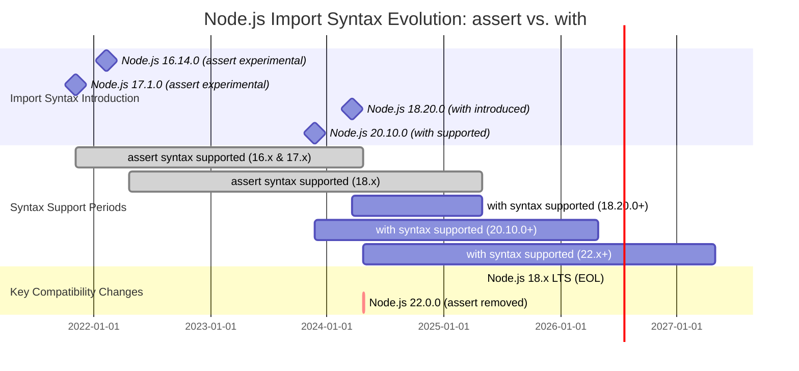

If you're reading this, chances are you have encountered this syntax in your project or an error message associated to using `assert`. Today's post delves into a change in how we import JSON files using ES Modules (ESM) in Node.js, the transition from `assert` keyword to `with` keyword:

```diff lang="js" ins="with" del="assert"
-import data from "./data.json" assert { type: "json" }
+import data from "./data.json" with { type: "json" }
```

***TL;DR** The `with` keyword is supported from Node.js 18.20.0 onwarwds. If you don't need to support older version, replace `assert` to `with`.*

This article provides an overview of the syntax change from `assert` to `with` in ES module imports, including its background, rationale, and compatibility considerations.

## Understanding `assert`

The `assert { type: "json" }` syntax was introduced as part of the "Import Assertions" proposal [^6]. It allowed developers to explicitly specify the expected MIME type when importing JSON modules:

```javascript
import config from './config.json' assert { type: 'json' };
const dynamic = await import('./data.json', { assert: { type: 'json' } });
```

This feature was designed to enhance security by preventing malicious servers from delivering executable JavaScript code disguised as JSON files. The assertion would terminate the import operation if the module's actual MIME type did not match `application/json`. [^4] [^10] [^11]

## The Shift to `with` Keyword

The `assert` keyword has been officially deprecated and is being replaced with `with` as part of the "Import Attributes" proposal. [^10] The updated syntax for static imports is:

```javascript
import config from './config.json' with { type: 'json' };
```

For dynamic imports, the attributes are now passed as a property within an options object:

```javascript
import('./config.json', { with: { type: 'json' } });
```

This change represents more than just a syntactic alteration; it signifies a fundamental shift in how these declarations operate. [^17] The transition from `assert` to `with` was driven by the identification of incompatibilities between the original design and established web architecture. [^10]

### Rationale for the Change

The original `assert` keyword had several limitations:

1. It could not modify HTTP request headers (e.g., sending an `Accept: application/json` header) to explicitly request a specific content type from the server.
2. This meant the client's expectation regarding the content type was not communicated during the initial fetch operation.
3. The type of resource being requested dictates which Content Security Policies (CSPs) are applied, and because `assert` lacked the ability to influence the fetch behavior, it could not correctly interact with the web's security model.

To address these deficiencies, "Import Attributes" (`with`) were developed with more flexible semantics that allow them to directly influence how a module is loaded, including generating appropriate HTTP request headers and ensuring proper alignment with web security policies.

## Node.js Version Compatibility

The following table details Node.js version support for `import... assert` versus `import... with`:

| Node.js Version Range | `assert` Support | `with` Support |
| --- | --- | --- |
| 16.14.0 - 17.x | Yes \* | No |
| 18.0.0 - 18.19.x | Yes | No |
| 18.20.0 - 21.x | Yes (Deprecated) | Yes |
| 22.0.0+ | No (Removed) | Yes |

<sup>\* *(Experimental, `--experimental-json-modules` flag needed initially)*</sup> [^12]


### Key Compatibility Notes

- Node.js versions 16.14.0 and 17.1.0 were the first to introduce experimental support for `import assertions`. [^12]
- Node.js version 18.20.0 added support for `import attributes`, facilitating migration. [^13]
- Node.js version 22.0.0 and later have removed support for `assert` in favor of `with`. [^22]

This created an overlap period where certain Node.js versions might have recognized both syntaxes.

<div style="width: 100%; overflow: auto;">



</div>

A critical point exists regarding compatibility: Node.js 18.x versions prior to 18.20.0 did not support the `with` syntax. This means that if code is changed to immediately adopt the `with` syntax, Node.js 18.x versions prior to 18.20.0 will produce an error: [^8] [^9]

```ansi
SyntaxError: Unexpected identifier 'with'
    at ESMLoader.moduleStrategy (node:internal/modules/esm/translators:117:18)
    at ESMLoader.moduleProvider (node:internal/modules/esm/loader:361:14)
    at async link (node:internal/modules/esm/module_job:70:21)

Node.js v17.9.1
```

Conversely, continuing to use the `assert` syntax will cause errors in Node.js 22.x and later versions:

```ansi
SyntaxError: Unexpected identifier 'assert'
    at compileSourceTextModule (node:internal/modules/esm/utils:344:16)
    at ModuleLoader.moduleStrategy (node:internal/modules/esm/translators:105:18)
    at #translate (node:internal/modules/esm/loader:534:12)
    at ModuleLoader.loadAndTranslate (node:internal/modules/esm/loader:581:27)
    at async ModuleJob._link (node:internal/modules/esm/module_job:154:19)

Node.js v22.17.1
```

## Migration Strategies

For projects targeting modern Node.js versions (18.20.0+), the most straightforward path is to replace `assert` with `with`. However, for projects requiring broader compatibility:

**Option 1: Target a Specific Modern Node.js Version**

Mandate a minimum Node.js version (e.g., 18.20.0 or later) to simplify migration.

**Option 2: Use `fs.readFileSync` and `JSON.parse`**

For broadest compatibility, use synchronous file reading with JSON parsing [^8]:

```javascript
import { readFileSync } from 'node:fs';
const config = JSON.parse(readFileSync(new URL('./config.json', import.meta.url), 'utf8'));
```

**Option 3: Utilize `createRequire` for CommonJS-like Loading in ESM**

For synchronous loading with caching behavior [^8]:

```javascript
import { createRequire } from 'node:module';
const require = createRequire(import.meta.url);
const config = require('./config.json');
```

## Future Directions of the `with` Keyword

Import Attributes, while a syntax feature themselves, lay the foundational groundwork for actual functionalities that leverage this syntax. [^11].

### CSS Modules

The `with` keyword enables native CSS module scripts, allowing the ability to load CSS stylesheets as constructable stylesheets [^19], represented by CSSStyleSheet objects, directly into the JavaScript module graph. The syntax mirrors that of JSON modules [^21]:

```javascript
import cssModule from "./styles.css" with { type: "css" };
document.adoptedStyleSheets = [cssModule];
shadowRoot.adoptedStyleSheets = [cssModule];
```

This feature is landed on Chrome 123. Be sure to check back for support in Firefox and Safari:
https://developer.mozilla.org/en-US/docs/Web/JavaScript/Reference/Statements/import/with#browser_compatibility

## Broader Implications

The `with` syntax aims to create a more extensible and performant module system for the web. It allows native browser support for various asset types while presenting challenges in standardization, tool adaptation, and backward compatibility.

## Conclusion

The `assert` syntax is deprecated and will be removed. Developers should migrate to the `with` syntax to ensure compatibility with newer Node.js releases.

For projects requiring broad compatibility, consider alternative strategies like using `fs.readFileSync` or `createRequire`. Always implement robust error handling when importing or parsing JSON.

## References

[^1]: [MildDev: Import JSON in Node.js](https://milddev.com/nodejs-how-to-import-json-file)
[^2]: [DEV Community: Importing JSON and Watch Mode in Node.js](https://dev.to/sovannaro/mporting-json-and-watch-mode-in-nodejs-4dcf)
[^3]: [ui.dev: ECMAScript, TC39, and the History of JavaScript](https://ui.dev/ecmascript)
[^4]: [MDN Web Docs: Import attributes - JavaScript](https://developer.mozilla.org/en-US/docs/Web/JavaScript/Reference/Statements/import/with)
[^5]: [Node.js API Documentation: Modules: ECMAScript modules](https://nodejs.org/docs/latest-v24.x/api/esm.html)
[^6]: [TC39 GitHub: proposal-json-modules](https://github.com/tc39/proposal-json-modules)
[^7]: [InfoQ: TC39 Advances Nine JavaScript Proposals, Including Array.fromAsync, Error.isError, and Using](https://www.infoq.com/ews/2025/06/tc39-stage-4-2025/)
[^8]: [Stack Overflow Discussion: SyntaxError: Unexpected identifier 'assert' on JSON import in Node v22](https://stackoverflow.com/questions/78876691/syntaxerror-unexpected-identifier-assert-on-json-import-in-node-v22)
[^9]: [GitHub Issue: Re-flag `assert` syntax for import attributes in Node.js 22](https://github.com/nodejs/node/issues/51622)
[^10]: [V8 Dev Blog: Import Attributes](https://v8.dev/features/import-attributes)
[^11]: [2ality Blog: ECMAScript feature: import attributes](https://2ality.com/2025/01/import-attributes.html)
[^12]: [Node.js Release Blog: Node v16.14.0 (LTS)](https://nodejs.org/en/blog/release/v16.14.0)
[^13]: [Node.js Release Blog: Node v18.20.0 (LTS)](https://nodejs.org/en/blog/release/v18.20.0)
[^14]: [Fedora Security Advisory: nodejs](https://bodhi.fedoraproject.org/updates/FEDORA-2022-97b214b298)
[^15]: [MDN Web Docs: Import attributes - JavaScript](https://developer.mozilla.org/en-US/docs/Web/JavaScript/Reference/Statements/mport/with)
[^16]: [Node.js API Documentation: Modules: node:module](https://r2.nodejs.org/docs/v20.10.0/api/module.html)
[^17]: [TC39 GitHub: proposal-import-attributes](https://github.com/tc39/proposal-import-attributes)
[^18]: [Node.js Release Blog: Node v20.18.0 (LTS)](https://nodejs.org/en/blog/release/v20.18.0)
[^19]: [Using CSS Module Scripts to import stylesheets](https://web.dev/articles/css-module-scripts)
[^20]: [TC39 GitHub: proposal-source-phase-imports](https://github.com/tc39/proposal-source-phase-imports)
[^21]: [2ality Blog: ECMAScript feature: import attributes - css modules](https://2ality.com/2025/01/import-attributes.html#css-modules)
[^22]: [Node.js Release Blog: Node v20.18.0 (LTS)](https://nodejs.org/en/blog/release/v22.0.0)
