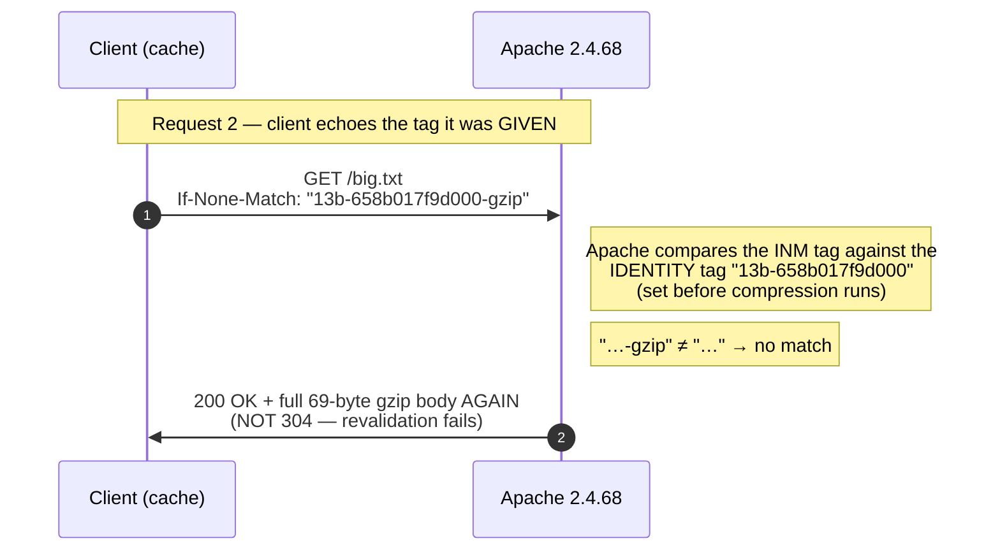
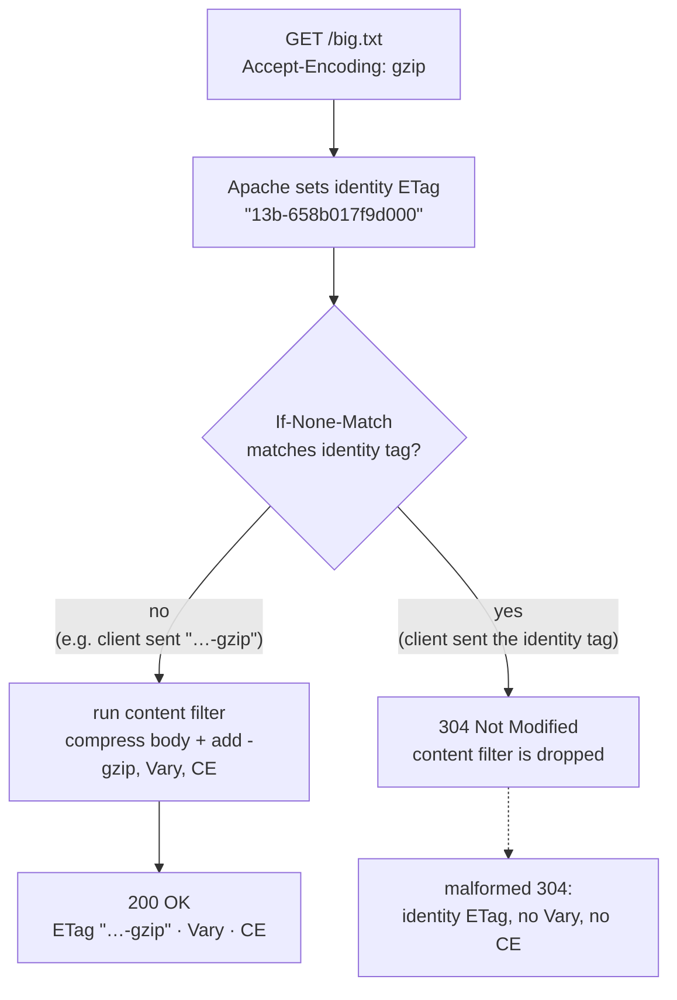

This is a follow-up to the study on [ETag vs Last-Modified](../http-etag-last-modified-study/).
That one covered how Apache generates its two validators and how it evaluates
`If-None-Match` / `If-Modified-Since`. This one asks a different question:

> What happens to the `ETag` the moment you turn on content-encoding — gzip
> (`mod_deflate`) or brotli (`mod_brotli`) — and does the result still comply with
> [RFC 9110](https://www.rfc-editor.org/rfc/rfc9110)?

All Apache results below were verified empirically against **2.4.68** in a podman
container. The traffic is captured as
[before-fix and after-fix HAR files](#see-it-for-yourself-import-the-hars-into-your-network-tab)
you can drop into your own Network tab.

## TL;DR

Enabling gzip/br makes Apache rewrite the `ETag` (append `-gzip` / `-br`). That
rewrite happens **after** the `If-None-Match` check, so the tag a client is given and
echoed back never matches what Apache compares against: revalidation of compressed
content returns `200` instead of `304`. And the rare `304` that *does* come back is
malformed (identity `ETag`, no `Vary`, no `Content-Encoding`). It's three
`MUST`-level violations of RFC 9110. Fix: `DeflateAlterETag NoChange` /
`BrotliAlterETag NoChange`.

---

## How revalidation is *supposed* to work

A client that has a cached copy revalidates by echoing the validator it was given:

```text
1. GET  /big.txt            -> 200, ETag: "abc"
2. GET  /big.txt            -> 304   (client sends If-None-Match: "abc")
   If-None-Match: "abc"
```

If the tag still matches, the server answers **304 Not Modified** and sends no body;
the client keeps using its cached copy. That's the whole point of an `ETag`.

The subtlety is **what the tag means**. `If-None-Match` is compared against the
*selected representation* — the exact bytes that would be sent for *this* request.
If the response is gzip-compressed, the selected representation is the gzip one, and
its tag must be distinct from the uncompressed one's.

## Compression changes the tag

For a 315-byte file whose identity (unencoded) tag is `"13b-658b017f9d000"`:

```sh
$ curl -sI http://localhost:18080/plain/big.txt -H 'Accept-Encoding: gzip' | tr -d '\r' | grep -iE 'HTTP|etag|vary|content-encoding|content-length'
HTTP/1.1 200 OK
ETag: "13b-658b017f9d000-gzip"
Vary: Accept-Encoding
Content-Encoding: gzip
Content-Length: 69
```

The tag is now `"13b-658b017f9d000-gzip"`: the identity tag with `-gzip` appended.
Brotli does the same with `-br`. This is the `AddSuffix` behaviour, the **default** for
both `DeflateAlterETag` and `BrotliAlterETag`.

The RFC endorses exactly this. [RFC 9110 §8.8.3.3](https://www.rfc-editor.org/rfc/rfc9110#section-8.8.3.3)
(*"Entity Tags Varying on Content-Negotiated Resources"*) shows the identity and gzip
representations carrying different tags (`"123-a"` vs `"123-b"`), both with
`Vary: Accept-Encoding`, and notes:

> Content codings are a property of the representation data, so a strong entity tag
> for a content-encoded representation **has to be distinct** from the entity tag of
> an unencoded representation to prevent potential conflicts during cache updates and
> range requests.

So the `200` here is **correct**. The client caches the gzip body under
`ETag: "13b-658b017f9d000-gzip"`.

> **Small files.** The suffix is only added when the filter actually compresses, and
> the two modules disagree on thresholds: `mod_deflate` skips a 4-byte body (identity
> tag, no suffix), while `mod_brotli` compresses it (`"4-…-br"`). Same file, two
> different tags depending on which encoder fires.

## The problem in one picture

Now the client revalidates the gzip representation. It faithfully echoes the tag it
was **given** — `"13b-658b017f9d000-gzip"`:



And that's exactly what happens:

```sh
$ curl -sI http://localhost:18080/plain/big.txt -H 'Accept-Encoding: gzip' \
    -H 'If-None-Match: "13b-658b017f9d000-gzip"' | tr -d '\r' | grep -iE 'HTTP|content-length'
HTTP/1.1 200 OK
Content-Length: 69          # the body is sent again
```

The tag the client is **given** and the tag Apache **compares against** are two
different strings that never match. So revalidation of compressed content is dead:
every "is my copy still valid?" request re-downloads the whole body.

## Why: Apache decides before it transforms

The root cause is *ordering*. Apache sets the identity `ETag` and evaluates
`If-None-Match` **before** the compression filter runs; the filter rewrites the tag
afterward. The client only ever sees the post-filter tag, but the decision was made
on the pre-filter one.

## And the 304 that does come back is also malformed

The only way to get a `304` is to send the **identity** tag (which the client never
received). When you do, the filter — which would have added `Vary`,
`Content-Encoding`, and the `-gzip` suffix — is skipped entirely:



Live proof: revalidating with the identity tag returns a `304`, but look at what it
carries:

```sh
$ curl -sI http://localhost:18080/plain/big.txt -H 'Accept-Encoding: gzip' \
    -H 'If-None-Match: "13b-658b017f9d000"' | tr -d '\r'
HTTP/1.1 304 Not Modified
Date: Wed, 09 Sep 2026 02:44:50 GMT
Server: Apache/2.4.68 (Unix)
Last-Modified: Mon, 10 Aug 2026 12:00:00 GMT
ETag: "13b-658b017f9d000"        # identity tag, NOT "…-gzip"
Accept-Ranges: bytes             # no Vary, no Content-Encoding
```

Why is the filter dropped on a 304? In `modules/filters/mod_filter.c`,
`filter_harness()` removes the output filter for any non-`200` response:

```c
if (f->r->status != 200
    && !apr_table_get(f->r->subprocess_env, "filter-errordocs")) {
    ap_remove_output_filter(f);
    return ap_pass_brigade(f->next, bb);
}
```

So a 304 never re-runs the filter that would have added the headers the 200 had.
(A 2.4.36 fix tried to handle 304s specially, but it's unreachable behind this check:
dead code.)

## The three RFC violations

| # | Request | Apache 2.4.68 | RFC 9110 requires |
|---|---------|---------------|-------------------|
| 1 | `GET` + `AE: gzip` | 200 · `ETag: "…-gzip"` · `Vary` · `CE: gzip` | 200 ✓ |
| 2 | `GET` + `AE: gzip` + `INM: "…-gzip"` | **200** + body | **304** ([§13.1.2](https://www.rfc-editor.org/rfc/rfc9110#section-13.1.2)) |
| 3 | `GET` + `AE: gzip` + `INM: "…"` | **304** · `ETag: "…"` · no `Vary` · no `CE` | 304 · `ETag: "…-gzip"` · `Vary` · `CE` ([§15.4.5](https://www.rfc-editor.org/rfc/rfc9110#section-15.4.5)) |

Row 1 is the control and is fine. Rows 2 and 3 are the violations; row 3 bundles two
of them (a wrong `ETag` *and* a missing `Vary`), which is where the "three" in the
TL;DR comes from.

- **Row 2 — revalidation returns 200, not 304.** [§13.1.2](https://www.rfc-editor.org/rfc/rfc9110#section-13.1.2)
  (`If-None-Match`): the condition is *false* when a listed tag "matches the entity
  tag of the selected representation", and then the server "MUST respond with … 304".
  The selected representation (gzip) has tag `"…-gzip"` — Apache sent it — so a `304`
  is required. Apache returns `200`.
- **Row 3 — the 304 sends the wrong `ETag` and drops `Vary`.** [§15.4.5](https://www.rfc-editor.org/rfc/rfc9110#section-15.4.5)
  (`304 Not Modified`): the server "MUST generate any of the following header fields
  that would have been sent in a 200 (OK) response to the same request: …
  **ETag**, and **Vary**". The 200 sends `"…-gzip"` and `Vary`; the 304 sends neither.

There is a real tension *inside* the RFC here: §8.8.3.3 wants **distinct** tags (to
avoid cache-update conflicts), §13.1.2 wants revalidation to **work**, and §15.4.5
wants the 304 to **mirror** the 200. A compliant server does all three: give the gzip
rep a distinct tag, accept it on revalidation, and echo it on the 304. Apache does
only the first, because it evaluates the condition before the filter rewrites the tag.
It's an implementation limitation, not something the spec makes impossible.

## See it for yourself: import the HARs into your Network tab

Both traces below were captured live against Apache 2.4.68. To watch them in **your
own browser's Network tab**: download the `.har`, open DevTools (`F12`) → **Network**,
then drag the file onto the panel and drop it (or right-click → *Import HAR file*).
Click each `big.txt` request and read the **Headers**.

**Before the fix**: default config (`DeflateAlterETag AddSuffix`) — revalidation of
the compressed copy fails.

<a class="download" href="artifact/etag-revalidation-before-fix.har" download>Download before-fix HAR</a>

| # | Request | Status | What to look at |
|---|---------|:------:|-----------------|
| 1 | `GET /big.txt` | 200 | identity body; `ETag: "13b-658b017f9d000"` — the pre-compression tag |
| 2 | `GET /big.txt` + `AE: gzip` | 200 | `ETag: "13b-658b017f9d000-gzip"`, `Vary: Accept-Encoding`, `Content-Encoding: gzip` — **the tag the client caches** |
| 3 | `GET` + `AE: gzip` + `INM: "…-gzip"` | **200** | echoes the tag from entry 2, yet the full 69-byte gzip body is **re-sent — should be 304** |
| 4 | `GET` + `AE: gzip` + `INM: "…"` | **304** | identity `ETag`, **no `Vary`, no `Content-Encoding`** — the only 304 Apache will give, and it's malformed |

Entry 3 is the wasteful re-download: a correct revalidation that a compliant server
would answer with `304` (RFC 9110 §13.1.2). Entry 4 only happens if the client sends
the *identity* tag it was never given — and the `304` carries the wrong `ETag` and
drops `Vary`/`Content-Encoding` (§15.4.5).

**After the fix**: `DeflateAlterETag NoChange` / `BrotliAlterETag NoChange` — the
compressed copy keeps the identity tag, so revalidation works.

<a class="download" href="artifact/etag-revalidation-after-fix.har" download>Download after-fix HAR</a>

| # | Request | Status | What to look at |
|---|---------|:------:|-----------------|
| 1 | `GET /big.txt` | 200 | identity body; `ETag: "13b-658b017f9d000"` |
| 2 | `GET /big.txt` + `AE: gzip` | 200 | `ETag: "13b-658b017f9d000"` (**same** — no `-gzip`), `Vary`, `Content-Encoding: gzip` |
| 3 | `GET` + `AE: gzip` + `INM: "…"` | **304** | **no body — the cache is revalidated correctly** |

Compare entry 3 in the two files: it's `200` in the before-fix trace and `304` in the
after-fix trace — the whole bug in one row. (The after-fix `304` still omits `Vary`/
`Content-Encoding`, but that's now harmless because the `ETag` matches.)

## Is this a bug?

It splits into two different things:

1. **The revalidation break is a documented trade-off.** The
   [`DeflateAlterETag`](https://httpd.apache.org/docs/2.4/mod/mod_deflate.html) and
   [`BrotliAlterETag`](https://httpd.apache.org/docs/2.4/mod/mod_brotli.html)
   reference pages say, of the `AddSuffix` default, that it "prevents serving
   `304` (Not Modified) responses to conditional requests for compressed content."
   Apache knows, and ships `NoChange`/`Remove` as the escape hatches. It's a
   deliberate choice — but it's still a deviation from a `MUST`, and it's the
   *default*.
2. **The malformed 304 is a genuine latent bug.** When you *do* get a 304, it is not
   the 304 the RFC requires: wrong `ETag`, no `Vary`, no `Content-Encoding`. This
   isn't documented as intended — it's the shadowed 2.4.36 fix described above.

## A short version history

| Apache | Year | What changed |
|--------|------|--------------|
| 2.4.0 | 2012 | `mod_deflate` began suffixing ETags with `-gzip`. (2.2.x never did.) |
| 2.4.26 | 2017 | `mod_brotli` introduced — with `BrotliAlterETag` **from day one**, so brotli was configurable while deflate was not. |
| 2.4.35 | 2018 | Both content filters started skipping non-200 statuses entirely — a regression that disabled any 304 header fix-up. |
| 2.4.36 | 2018 | `mod_deflate`/`mod_brotli` gained a dedicated 304 branch (per RFC 7232 §4.1) — but the `mod_filter` harness strips the filter first, so it's unreachable. |
| 2.4.58 | 2024 | `DeflateAlterETag` added to `mod_deflate`, finally mirroring `BrotliAlterETag`. |
| 2.4.68 | current | Still non-compliant by default. No 2.5 has been released; the in-development trunk still has the same harness check. |

So updating Apache does not fix this — the behaviour is present in every current
release and in trunk.

## What to do about it

If ETag revalidation matters for your compressed static assets, opt out of the
suffix:

```apache
DeflateAlterETag NoChange
BrotliAlterETag  NoChange
```

The three modes, and what each trades off:

| Mode | ETag on a compressed 200 | Revalidation (`INM`) | Cost |
|------|--------------------------|----------------------|------|
| `AddSuffix` (default) | `"X-gzip"` / `"X-br"` | **broken** — always 200 | distinct tags, but compressed revalidation never 304s |
| `NoChange` | `"X"` (same as identity) | **works** — 304 | ETag no longer unique per representation |
| `Remove` | *(no ETag)* | IMS-only — `If-Modified-Since` decides | you lose ETag validation for compressed responses entirely |

`NoChange` is the pragmatic fix for most static sites: the ETag is identical across
encodings, so a client echoing back `"X"` gets a proper `304`. The trade-off is that
the tag is no longer unique per representation — but that is a `SHOULD`-level
deviation (and it's exactly how Apache behaved before 2.4.0), not a `MUST` violation,
and change detection is unaffected because the tag still tracks the identity
representation's mtime/size. Note the 304 still lacks `Vary`/`Content-Encoding` under
`NoChange`, but that's now harmless because the tag matches.

`Remove` is the nuclear option: it eliminates the inconsistency by removing the ETag
from compressed responses, at the cost of dropping ETag validation for them.

## Practical checklist

1. **Know that enabling gzip/br changes your ETags.** With the default `AddSuffix`,
   compressed responses carry `"…-gzip"` / `"…-br"` tags that differ from the
   identity tag.
2. **ETag revalidation is dead for compressed content by default.** A client that
   echoes back the suffixed tag it was given gets a `200`, not a `304`. If your
   bandwidth model depends on 304s, set `DeflateAlterETag NoChange` and
   `BrotliAlterETag NoChange`.
3. **A 304 from Apache for a compressed asset is not the RFC 304.** It carries the
   identity ETag and omits `Vary` and `Content-Encoding`. Don't write cache logic
   that assumes the 304 mirrors the 200's representation headers.
4. **The two encoders disagree on small files.** `mod_deflate` skips bodies below its
   minimum (identity tag, no suffix); `mod_brotli` has no minimum. The same asset can
   carry different ETags depending on which encoder fires.
5. **Don't parse the `-gzip`/`-br` suffix off the ETag** as a reliable signal — it's
   an implementation detail of `AddSuffix` and disappears under `NoChange`/`Remove`.
6. **Updating Apache won't help.** The behaviour is the default in 2.4.68 and is
   unchanged in trunk.

## Reproducing the results

Everything above was produced with a clean podman container
(`docker.io/library/httpd:2.4-alpine`, Apache 2.4.68, served on `localhost:18080`).

### 1. Create the files

```sh
mkdir -p htdocs/plain
printf 'The quick brown fox jumps over the lazy dog. %.0s' {1..7} > htdocs/plain/big.txt   # 315 bytes
printf 'AAAA' > htdocs/plain/small.txt   # 4 bytes
touch -d '2026-08-10 12:00:00 UTC' htdocs/plain/big.txt htdocs/plain/small.txt
```

### 2. httpd.conf

```
ServerRoot "/usr/local/apache2"
Listen 8080

LoadModule mpm_event_module modules/mod_mpm_event.so
LoadModule authz_core_module modules/mod_authz_core.so
LoadModule authz_host_module modules/mod_authz_host.so
LoadModule unixd_module modules/mod_unixd.so
LoadModule mime_module modules/mod_mime.so
LoadModule dir_module modules/mod_dir.so
LoadModule log_config_module modules/mod_log_config.so
LoadModule filter_module modules/mod_filter.so
LoadModule deflate_module modules/mod_deflate.so
LoadModule brotli_module modules/mod_brotli.so

User daemon
Group daemon
ServerAdmin study@example.com
ServerName localhost
DocumentRoot "/usr/local/apache2/htdocs"

<Directory "/">
    Require all denied
</Directory>
<Directory "/usr/local/apache2/htdocs">
    Options Indexes
    AllowOverride None
    Require all granted
</Directory>

# Two gotchas that silently disable compression if you get them wrong:
#  - mod_brotli registers its filter as "BROTLI_COMPRESS", not "brotli"
#  - this image maps .js -> text/javascript, so list both JS MIME types
AddOutputFilterByType deflate text/plain text/javascript application/javascript
AddOutputFilterByType BROTLI_COMPRESS text/plain text/javascript application/javascript

# To test the fix:
# DeflateAlterETag NoChange
# BrotliAlterETag  NoChange

LogLevel core:trace8
ErrorLog /proc/self/fd/2
CustomLog /proc/self/fd/2 combined
```

### 3. Start Apache and probe it

```sh
podman rm -f httpd-etag-gz 2>/dev/null || true
podman run -d --name httpd-etag-gz \
  --mount type=bind,src=$PWD/htdocs,dst=/usr/local/apache2/htdocs \
  --mount type=bind,src=$PWD/httpd.conf,dst=/usr/local/apache2/conf/httpd.conf \
  -p 18080:8080 docker.io/library/httpd:2.4-alpine

B=http://localhost:18080/plain/big.txt
ID='13b-658b017f9d000'   # identity tag for the 315-byte file

# 1) the 200 the client caches
curl -sI "$B" -H 'Accept-Encoding: gzip' | tr -d '\r' | grep -iE 'HTTP|etag|vary|content-encoding'
#    HTTP/1.1 200 OK   ETag: "13b-658b017f9d000-gzip"   Vary: Accept-Encoding   Content-Encoding: gzip

# 2) revalidate with the SUFFIXED tag (what the client was given) -> 200, not 304
curl -s -o /dev/null -w 'INM suffixed -> %{http_code}\n' "$B" -H 'Accept-Encoding: gzip' -H "If-None-Match: \"${ID}-gzip\""
#    INM suffixed -> 200

# 3) revalidate with the IDENTITY tag -> 304, but malformed (no Vary / CE, identity ETag)
curl -sI "$B" -H 'Accept-Encoding: gzip' -H "If-None-Match: \"${ID}\"" | tr -d '\r' | grep -iE 'HTTP|etag|vary|content-encoding'
#    HTTP/1.1 304 Not Modified   ETag: "13b-658b017f9d000"   (no Vary, no Content-Encoding)
```

With `DeflateAlterETag NoChange` / `BrotliAlterETag NoChange` uncommented, probe 1
returns the **plain identity ETag** (`"13b-658b017f9d000"`, no `-gzip`), and revalidating
with that tag — probe 3, the tag a real client would now hold — returns **304**. (Probe 2
still 200s: it sends a `-gzip` suffix that `NoChange` never issues.)

The traces shown in the post were captured live against this setup. You can
<a href="artifact/etag-revalidation-before-fix.har" download>download the before-fix
HAR</a> and the
<a href="artifact/etag-revalidation-after-fix.har" download>after-fix HAR</a> and drop
them into your DevTools Network tab to inspect them without running anything. If you
run the probes above against your own server, your responses should match them line
for line.

---

**Further reading**: [RFC 9110 §8.8.3.3, Entity Tags Varying on Content-Negotiated Resources](https://www.rfc-editor.org/rfc/rfc9110#section-8.8.3.3) ·
[RFC 9110 §13.1.2, If-None-Match](https://www.rfc-editor.org/rfc/rfc9110#section-13.1.2) ·
[RFC 9110 §15.4.5, 304 Not Modified](https://www.rfc-editor.org/rfc/rfc9110#section-15.4.5) ·
[Apache `DeflateAlterETag`](https://httpd.apache.org/docs/2.4/mod/mod_deflate.html) ·
[Apache `BrotliAlterETag`](https://httpd.apache.org/docs/2.4/mod/mod_brotli.html) ·
[Apache `mod_filter` source](https://github.com/apache/httpd/blob/2.4.68/modules/filters/mod_filter.c) ·
[before-fix HAR](artifact/etag-revalidation-before-fix.har) ·
[after-fix HAR](artifact/etag-revalidation-after-fix.har) ·
Companion post: [HTTP cache validators: ETag vs Last-Modified](../http-etag-last-modified-study/)
