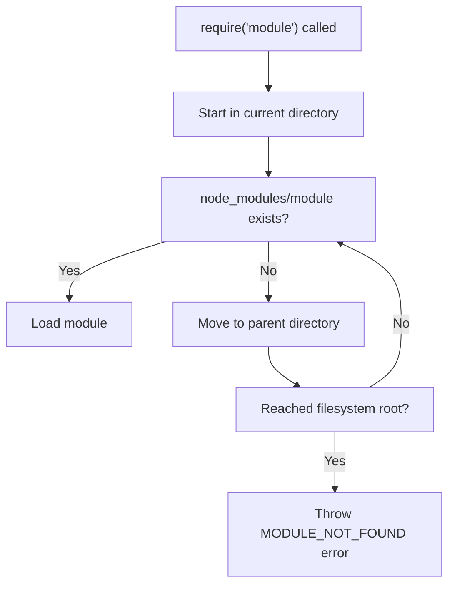
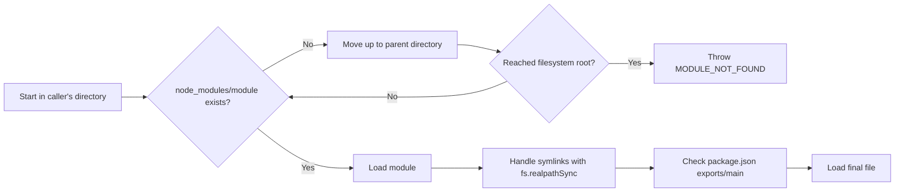

This blog post aims to demystify the Node.js module resolution algorithm, specifically focusing on how it locates `node_modules` directories. The journey will cover various scenarios, from simple flat repositories to deeply nested dependency trees and the complexities introduced by symlinks and peer dependencies.

## The Mysterious Case of the Missing Module

> **The Scenario**
>  Debugging a complex monorepo where a seemingly simple `require('lodash')` call behaves inconsistently. In your top-level `app.js`, it works perfectly. But when executed within a deeply nested package like `packages/api`, it fails with mysterious errors.

 This discrepancy forms the central mystery we'll solve. Node.js module resolution, while governed by a consistent algorithm, is **highly sensitive to the directory structure** from which the `require()` call originates.

## How Node.js Finds Your `node_modules`

The core algorithm relies solely on the physical directory structure and naming conventions.

This Mermaid graph illustrates Node.js's module resolution algorithm. It shows how Node.js searches for a module when `require('module')` is called.



The process begins by looking for the module in the **current directory's `node_modules` folder**. If found, the module is loaded. If not, Node.js **moves up to the parent directory** and repeats the search in that directory's `node_modules` folder. This process **continues iteratively** until either the module is found and loaded, or the **filesystem root is reached**. If the root is reached without finding the module, a **`MODULE_NOT_FOUND` error** is thrown.

---

## Anatomy of a Resolution Walk

**Legend for Diagram**

| Color | Meaning
| -- | -- |
| <code style="color:blue" data-ansi="34">file.js</code> | JavaScript file calling `require()`
| <code style="color:green" data-ansi="32">node_modules</code> | `node_modules` directory `require()`
| <code style="color:maroon" data-ansi="31">symlink</code> | Symbolic link to another path

The directory tree diagrams in the following sections will be marked with different colors to illustrate the file or folder of interest.

In this section we will walkthrough 3 scenarios:

1. Base Case – Flat Repository Structure
2. One-Level Nesting – Lerna-Style Packages
3. Deep Nesting – Transitive Dependency Hell

### 1. Base Case – Flat Repository Structure

The simplest scenario to illustrate is a **flat repository structure**, often found in small projects or individual packages. Consider a project named `project` with the following structure:

```ansi
project/
├─ app.js
└─ node_modules/
  └─ lodash/
```

In this setup, if app.js contains the line `import _ from 'lodash';`, Node.js resolves it as follows:

- The `import 'lodash'` call originates from `project/app.js`.
- Node.js first checks for `project/app.js/node_modules/lodash`. This path is invalid because `app.js` is a file, not a directory.
  So, it effectively looks in `project/node_modules/lodash` relative to the `app.js` file’s directory.
- It finds `project/node_modules/lodash` and successfully loads the Lodash module.

This example demonstrates the most straightforward application of the algorithm: the module is located in the node_modules directory adjacent to the file requiring it. There’s no need to traverse up the directory tree. This visual establishes the foundational understanding before moving to more complex, nested scenarios.

### 2. One-Level Nesting – Lerna-Style Packages

Moving to a slightly more complex structure, we consider a monorepo with **one level of nesting**, common in projects using tools like Lerna or Yarn Workspaces. The directory tree might look like this:

```ansi
monorepo/
├─ packages/
│  └─ api/
│     ├─ index.js
│     └─ node_modules/
│        └─ debug/
└─ node_modules/
  └─ lodash/
```

Here, we have a `packages` directory containing an `api` package. The `api` package has its own `node_modules` for `debug`, and the root of the monorepo has `node_modules` for `lodash`.

**Scenario 1: `api/index.js` requires `debug`**

1.  `require('debug')` is called from `monorepo/packages/api/index.js`.
2.  Node.js looks in `monorepo/packages/api/index.js/node_modules/debug` (invalid path, `index.js` is a file).
3.  It then correctly looks in `monorepo/packages/api/node_modules/debug`.
4.  `debug` is found and loaded from `monorepo/packages/api/node_modules/debug`.


**Scenario 2: `api/index.js` requires `lodash`**

1.  `require('lodash')` is called from `monorepo/packages/api/index.js`.
2.  Node.js looks in `monorepo/packages/api/node_modules/lodash`. It is not found there.
3.  It moves up to `monorepo/packages/node_modules/lodash`. It is not found there either (this `node_modules` directory doesn't exist in this example, but Node.js would check it).
4.  It moves up to `monorepo/node_modules/lodash`.
5.  `lodash` is found and loaded from the root `node_modules`.

This example demonstrates how **Node.js ascends the directory tree**. The `api` package can access its direct dependency (`debug`) locally and a shared dependency (`lodash`) from a higher-level `node_modules`. This structure is common for sharing common dependencies across multiple packages within a monorepo while allowing individual packages to manage their specific, potentially conflicting, dependencies.


### 3. Deep Nesting – Transitive Dependency Hell

This section addresses a more complex scenario often referred to as **“transitive dependency hell”**, where multiple versions of the same package can coexist at different levels of nesting. The directory structure is:

```ansi
monorepo/
├─ node_modules
│  └─ lodash@4.17.21
└─ packages
  └─ api
    ├─ index.js
    └─ node_modules
      ├─ debug
      └─ @scope
        └─ helper
          └─ node_modules
            └─ lodash@3.10.1
```

In this structure, the monorepo root has `lodash@4.17.21`. The `api` package directly depends on `debug` and a scoped package `@scope/helper`. This `@scope/helper` package, in turn, has its own `node_modules` containing `lodash@3.10.1` .

**Resolution for `require('lodash')` from `api/index.js`:**

1.  `api/index.js` calls `require('lodash')`.
2.  Node.js first checks `monorepo/packages/api/node_modules/lodash`. Not found.
3.  It moves up to `monorepo/packages/node_modules/lodash`. Not found (this directory doesn’t exist, but it’s checked).
4.  It moves up to `monorepo/node_modules/lodash`.
5.  **`lodash@4.17.21` is found and loaded.**

**Resolution for `require('lodash')` from within `@scope/helper` (e.g., from a file at `monorepo/packages/api/node_modules/@scope/helper/some-file.js`):**

1.  The `require('lodash')` call originates from within the `helper` package.
2.  Node.js first checks `monorepo/packages/api/node_modules/@scope/helper/node_modules/lodash`.
3.  **`lodash@3.10.1` is found and loaded from this nested `node_modules`.**

This example illustrates how **the same `require('lodash')` statement can resolve to different versions of Lodash depending on the calling file’s location**. `api/index.js` gets `lodash@4.17.21` from the root `node_modules`, while `@scope/helper` gets its own `lodash@3.10.1`.

This is a key characteristic of Node’s resolution strategy, allowing different parts of an application or different packages to use different versions of the same dependency if necessary, but also a common source of confusion and “dependency hell” if not managed carefully, especially when singletons or shared state are involved.

## Peer Dependencies & Doppelgängers: When Two Copies Collide

This section explores the challenges posed by **peer dependencies**, particularly for libraries like React that expect only a single instance to be loaded. The directory structure illustrates a common scenario in monorepos or projects with complex dependency trees :

```ansi
project/
├─ node_modules
│  ├─ react@17
│  └─ react-dom@17
└─ packages
  └─ ui
    ├─ package.json
    └─ node_modules
      ├─ react@18
      └─ react-dom@18
```

In this setup, the main `project` has `react@17` and `react-dom@17` installed in its root `node_modules`. A nested package, `packages/ui`, has its own `node_modules` containing `react@18` and `react-dom@18`, perhaps because it's a newer component library or has specific version requirements.

If a component from `packages/ui` is used by an application that also directly or transitively depends on `react@17` from the root `node_modules`, **both versions of React might get bundled or loaded into the application**. From Node.js's perspective, `react@17` in `project/node_modules/react` and `react@18` in `project/packages/ui/node_modules/react` are distinct modules because they reside in different `node_modules` directories. They will have separate module scopes and internal states.


> Multiple React instances will cause subtle bugs where context providers from one version won't be visible to components using another version.

Libraries like React expect only a single instance to be loaded. When multiple copies coexist, internal states become fragmented. React explicitly checks for multiple copies and throws errors like "Invalid hook call" when detected.


## Symlinks and Realpath: Navigating the maze

The example below illustrates `pnpm` managing packages using symlinks.

```ansi
project/
└─ node_modules/
   ├─ .pnpm/ -> ~/.pnpm-store/v3/... (links to global store)
   ├─ react -> .pnpm/react@18.0.0/node_modules/react
   └─ react-dom -> .pnpm/react-dom@18.0.0/node_modules/react-dom
```

When Node.js encounters a symlink during module resolution, it **resolves the symlink to its "real" path** using `fs.realpathSync()` before continuing the search.


When `require('react')` is called, Node.js:
1.  Sees `project/node_modules/react`.
2.  Follows the symlink to `.pnpm/react@18.0.0/node_modules/react`.
3.  The resolution continues from this *real* path.

**Why Realpath Prevents Duplicates (Mostly):**
By resolving symlinks to their real paths, Node.js ensures that if multiple symlinks point to the exact same physical package directory, that package is effectively a singleton from the perspective of `require()`. This is crucial for preventing duplicate copies of packages that are meant to be singletons (like React) when using package managers that leverage symlinking. However, if different versions of a package are physically located in different places (even if symlinked into a project), they will still be treated as separate modules. The key is that symlinks themselves don't create new instances; they are transparently resolved to the underlying real path.


## Package.json “exports”: The Final Hurdle

Once Node.js has successfully located the directory containing the requested package (e.g., `some_module` within a `node_modules` folder), there's one more crucial step before the specific module file is loaded: **consulting the `package.json` file of the found package, specifically its `"exports"` field**. This field, introduced in Node.js 12, allows package authors to define the public interface of their package, including:
*   **Main Entry Point**: Replacing or augmenting the traditional `"main"` field.
*   **Subpath Exports**: Defining specific entry points for sub-paths of the package (e.g., `require('some_module/utils')`).
*   **Conditional Exports**: Providing different entry points depending on the environment (e.g., `require`, `import`, `node`, `browser`, `development`, `production`).

**How `"exports"` Affects Resolution:**
The `"exports"` field **does not influence the *climb up* the directory tree to find the `node_modules/some_module` folder**. That part is purely structural. However, once `some_module` is found, `"exports"` dictates **which file *inside* `some_module` should actually be returned by `require('some_module')`**.

**Example:**
If `node_modules/some_module/package.json` contains:
```json
{
  "name": "some_module",
  "exports": {
    ".": "./lib/index.js",
    "./utils": "./lib/utils.js"
  }
}
```
Then:
*   `require('some_module')` will resolve to `node_modules/some_module/lib/index.js`.
*   `require('some_module/utils')` will resolve to `node_modules/some_module/lib/utils.js`.

If a requested subpath is not defined in `"exports"`, Node.js will throw an error (ERR_PACKAGE_PATH_NOT_EXPORTED), even if the file physically exists. This provides package authors with **strong encapsulation, preventing users from relying on internal, undocumented files**. The `"exports"` field is a powerful tool for defining clear and robust package APIs.

## Common Pitfalls Checklist: Don't Get Lost in the Woods

Understanding Node.js module resolution is key to avoiding common dependency issues. Here's a checklist of pitfalls to watch out for:

| Pitfall                                                      | Description                                                                                                | Prevention/Mitigation                                                                                                |
|--------------------------------------------------------------|------------------------------------------------------------------------------------------------------------|----------------------------------------------------------------------------------------------------------------------|
| **Accidental Singletons**                                    | Shipping multiple versions of a library that expects to be a singleton (e.g., React, GraphQL, Vue).        | Use peer dependencies correctly. Ensure build tools (Webpack, Rollup) are configured to dedupe or alias these packages. |
| **Misplaced `devDependencies` in Monorepos**                 | A package in a monorepo might rely on a `devDependency` installed at the root, causing `require()` to fail when the package is used standalone. | Be explicit about all dependencies in each package's `package.json`, even if they seem to be available at the monorepo root during development. |
| **`npm link` Without Understanding Symlinks**                | Using `npm link` can create symlinks that might lead to unexpected resolution if the linked package's own dependencies are not hoisted or managed correctly. | Understand how `npm link` affects `node_modules` structure. Consider using `npx link` or workspace features of package managers. |
| **Relying on `NODE_PATH`**                                   | `NODE_PATH` is largely ignored by modern Node.js and bundlers for module resolution.                       | **Rely solely on the standard `node_modules` resolution algorithm.** Use module aliasing in bundlers if non-standard paths are needed. |
| **Unintended Deep Nesting**                                  | Deeply nested `node_modules` can lead to very long paths (Windows path length limit) and slow performance. | Use package managers that optimize `node_modules` structure (e.g., pnpm, Yarn PnP). Keep dependency trees shallow where possible. |
| **Ignoring `package.json` `"exports"`**                      | Trying to `require` subpaths of a package that are not explicitly exported.                                | **Always check the package's documentation and `package.json` for its public API.** Respect package encapsulation.     |

*Table 2: Common pitfalls in Node.js module resolution and how to avoid them.*

By being aware of these common issues, developers can navigate the `node_modules` maze with greater confidence and avoid many frustrating debugging sessions.

## TL;DR Cheatsheet: Node Module Resolution at a Glance

For quick reference, here's a summary of the Node.js `require()` resolution algorithm:



1. **Start Local**: Begin in the directory of the file that called `require('module_name')`.
2. **Check `node_modules`**: Look for `./node_modules/module_name`.
    * If found, proceed to `package.json` "exports" or "main" lookup within that folder.
3. **Ascend**: If not found, move to the parent directory and repeat step 2.
4. **Repeat**: Continue moving up the directory tree, checking for `node_modules/module_name` at each level.
5. **Stop at Root**: The search terminates when:
    * The module is found, or
    * The filesystem root directory is reached (e.g., `/` or `C:\`). If the module isn't found by this point, Node.js throws a `MODULE_NOT_FOUND` error.
6. **Symlinks**: If a symlink is encountered (either the calling file's path involves a symlink or a `node_modules` folder is a symlink), **Node.js resolves it to its real, physical path (`fs.realpathSync`) before continuing the search**. This ensures the algorithm operates on actual file locations.
7. **`package.json` Finale**: Once the correct `node_modules/module_name` folder is located, Node.js reads its `package.json` file. The `"exports"` field (if present) dictates the exact entry point file. If `"exports"` is absent or doesn't match, the `"main"` field is used, defaulting to `index.js` if neither is specified.

Remember: **It's all about the directory structure and the upward climb!**

## Further Reading / References: Dive Deeper

To explore Node.js module resolution and related topics in more detail, consider the following resources:

*   **Node.js Official Documentation**: The [Modules: CommonJS modules](https://nodejs.org/api/modules.html#modules_all_together) section provides a comprehensive, technical description of the entire resolution algorithm, including core modules, file modules, and folder modules.
*   **Node.js Documentation on `"exports"`**: The [Package Exports](https://nodejs.org/api/packages.html#package-exports) section of the Packages documentation details the `"exports"` field, its syntax, and its various capabilities for defining package entry points and subpath exports.
*   **npm Blog**: The npm blog has historically published articles explaining new features and best practices. Search for posts related to `node_modules` structure, symlinking, or the `"exports"` field.
*   **Yarn Documentation on Plug'n'Play (PnP)**: [Yarn PnP](https://yarnpkg.com/features/pnp) offers a different approach to dependency management that eschews the traditional `node_modules` folder in favor of a single `.pnp.cjs` file that maps packages to their locations on disk. Understanding PnP can provide a contrasting perspective on module resolution challenges and solutions.
*   **pnpm Documentation**: The [pnpm documentation](https://pnpm.io/motivation) explains its unique `node_modules` structure using symlinks and a content-addressable store, which aims to save disk space and improve installation speed while maintaining compatibility with Node's resolution algorithm.

These resources offer deeper dives into the mechanics, rationale, and evolving landscape of JavaScript package management and module resolution.
