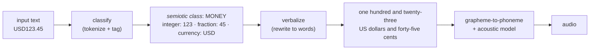

import CurrencyAudioGallery from "../../../src/components/mdx/CurrencyAudioGallery.astro";

A screen reader turns a screen into speech. On Windows you meet NVDA, Narrator and JAWS; on macOS and iOS, VoiceOver; on Android, TalkBack. It does not make the speech itself. It collects text and hands it to a speech synthesizer, the component that also reads e-books and GPS directions, then plays the audio it gets back.

The sound of your page depends on that hand-off, and on which voice the reader speaks through. Put two lines in a page:

```html
<p>USD123.45</p>
<p>SGD123.45</p>
```

On Windows 10 and 11, NVDA speaks through Windows OneCore by default [^37]. OneCore reads the first as *"one hundred and twenty-three US dollars and forty-five cents"* and the second as a spelled-out code followed by a decimal number: *"S G D, one hundred and twenty-three point four five"*. No "Singapore dollars", no cents. Narrator, Microsoft's own screen reader, uses OneCore too and produces the same two readings [^2] [^16].

NVDA also bundles eSpeak NG, the fallback used where OneCore is unavailable [^11] [^37]. eSpeak NG does not expand currency [^2], so on it both lines come out as letters and a decimal. The money reading above is OneCore's doing, not a property of NVDA itself.

The digits come through in both cases, so the number itself is read correctly. What `SGD` loses is the currency: the listener hears a code they have to decode, and never hears the currency's name or its minor unit. On a page that mixes Singapore and US amounts, they have to work out which currency they just heard, and can get it wrong.

That observation is from NVDA on Windows 10 using its default OneCore voice, and the two lines are plain text nodes in the same browser, and nothing but the code itself differs. The broader per-reader results later in the post come from a published comparison, and I did not re-run them.

The difference has to appear downstream of your markup. The string passes from the `<p>` into the DOM, into the browser's accessibility tree, through the screen reader, and into the operating system's speech engine. There, the engine's text normalizer matches it against a currency table, and one code is tagged as money while the other is not.

## TL;DR

The browser passes the string through. Chrome's accessibility tree hands the operating system `USD123.45` as plain text [^4], and Blink, Chrome's rendering engine, has no currency logic in the code that builds that tree [^3]. The screen reader passes it along too: NVDA holds no currency table, only a per-language symbol dictionary for punctuation [^1].

The synthesizer decides. Its text normalizer tags a token as *money* and rewrites it into words. NVDA's tracker names the engines that do this (Microsoft OneCore, SAPI5, IBM's IBMTTS) and the one that does not (eSpeak NG) [^2]. Windows, Android and Apple's synthesizers all normalize currency in the same place, and the readers forward the text [^2] [^17] [^19] [^22].

What differs is the currency list, which is short and rarely published [^16]. `$` and `USD` sit in the en-US table and `SGD` does not [^6]; NVDA and TalkBack ship no amount table of their own, only a symbol dictionary [^1] [^17], and the open normalizers from Google and NVIDIA ship small ones [^24] [^25]. HTML has no currency element [^27], so write the currency name out or supply the spoken form yourself.

Clips from two Google TTS builds on Android, Microsoft OneCore on Windows, and an eSpeak NG column let you [hear what the voice actually does](#the-clips-and-their-transcripts); the Google and OneCore columns are transcribed against the audio, and eSpeak appears as phonemes rather than words. The OneCore run is Windows 10 22H2 build **19045.2965** with the OneCore engine **10.3.21207.0** [^39].

## What Narrator and NVDA share

When two readers say the same thing, the cause lies in what they share: the browser and the speech engine. Both were reading Chrome, so if Blink expanded currency codes on the way into the accessibility tree, both readers would inherit the expansion. Narrator speaks through Microsoft's voices [^38]; NVDA speaks through the synthesizer it is set to, OneCore by default on Windows 10 and 11 [^2] [^37]. An NVDA that matches Narrator is running a Microsoft engine.

The browser is the only component upstream of the accessibility tree, so start there. If Chrome passes the text through unchanged, the rewrite has to happen after the tree, in an engine both readers can use.

## What Chrome hands over

Chrome builds an accessibility tree, a machine-readable map of the page, and exposes it to the operating system: to UIA on Windows, to AT-SPI on Linux [^3]. Screen readers read that tree, so an expansion added by the browser would show up in it.

A page with one text node per format:

```html
<p id="a">USD123.45</p>
<p id="b">SGD123.45</p>
<p id="c">$123.45</p>
<p id="d">US$123.45</p>
<p id="e">EUR123.45</p>
```

Here is the tree Chrome exposes for it, which you can read in DevTools under **Elements → Accessibility** [^4]:

```text
RootWebArea "currency announcement test cases"
  StaticText "USD123.45"
  StaticText "SGD123.45"
  StaticText "$123.45"
  StaticText "US$123.45"
  StaticText "EUR123.45"
```

Every node carries the literal string. Chrome adds no currency role and no spoken form. Blink's accessibility code, where such a rewrite would happen, holds no currency table and makes no `Intl.NumberFormat` call [^3]. It does build strings for other cases, such as alt text, but not for money.

## The screen reader forwards it

NVDA is open source, so "does NVDA expand currency?" is a question you can answer by reading the code. It does not. NVDA's speech code contains no currency table, no money rule and no amount parser. What it carries is a **symbol dictionary** per language that gives a spoken word for punctuation the synthesizer would otherwise skip [^1]. The dictionary has an entry for the `$` character. It does not read `USD123.45` as an amount.

The maintainers chose that division on purpose. In 2010 someone filed a request to have NVDA speak `$10.00` as an amount and `$0.50` as "50 cents". They closed it as work for the synthesizer [^1]:

> This sort of special processing is very controversial. Personally, I prefer to hear the text as close as possible to its original form, as there is less room for error. […] This is also probably something that should be done in the synthesiser, not in NVDA.

> As this is a synthesizer specific issue, can it therefore be closed? Using synths such as Eloquence, Vocalizer Expressive and Windows OneCore Voices, I do not experience this. It's something the eSpeak NG team needs to work on, in my view.

NVDA forwards the text and reports back what the synthesizer gives it. A Narrator/NVDA comparison therefore lines up only when both run on the same engine.

A 2022 bug fix shows the hand-off directly. An NVDA contributor tracked down a misreport and wrote up the cause [^2]:

> Read the following line with OneCore (e.g. Zira) and symbol level all: `What is USD????` … I can hear: *"What is four US dollars question"* […] The issue is due to the fact that the synth interprets `USD 4` as `four dollars`. […] The impacted synthesizers are: OneCore, SAPI5, IBMTTS. On the contrary, eSpeak is not impacted. Probably because it does not handle internally expressions such as `USD 4`.

The synthesizer rewrites `USD` plus a number into a spoken amount, and the list names which synthesizers do it. eSpeak NG, the free engine bundled with NVDA, does not. So some NVDA users hear "US dollars" and others hear letters, depending on the synthesizer they selected.

## Text normalization

A text-to-speech engine never starts from characters. It runs input through **text normalization** first, which turns written forms into spoken words: `2016` into *twenty sixteen*, `Dr.` into *doctor*, `12:45` into *twelve forty-five*, and `$34.90` into *thirty-four dollars and ninety cents* [^5] [^9].

Microsoft's speech API treats this as a named category. A `CONTEXT` attribute called `Currency` tells the engine to normalize a block of text as money, and the documentation gives its own example [^5]:

> `$34.90` will be normalized to *"thirty four dollars and ninety cents"*

Microsoft leaves the implementation to each engine, so each engine keeps its own currency list [^5].

Modern engines split the work into two steps [^9] [^10]:

<figure>



</figure>

The tagging step is what splits the two outcomes. A normalizer that tags the token `MONEY` writes a spoken amount: the number, the major unit, and the fraction expressed as a minor unit. A normalizer that finds nothing special reads the letters and then the number as a plain decimal [^9]. Those are the two results in the opening example.

The fallback reuses the same `TranslateNumber` machinery every engine needs for cardinals and decimals [^12]. eSpeak NG documents number fragments, decimal-point words and ordinals, and documents no currency table at all [^11] [^12]. To eSpeak, `SGD123.45` is an ordinary string of letters and a number.

## The same machinery handles dates and phone numbers

Currency is one *semiotic class* among several, alongside dates, times, measures, phone numbers, ordinals and fractions. An engine carries a table for each class, in each language, and the same distinction applies to each: a token is either in the table or not. A year written `2026` and a serial number `2026` take different paths through the same engine, and so do a known abbreviation and one that gets spelled out [^10]. When assistive technology reads a string wrong, the useful question is which layer recognized it as a class and which did not.

## Why `USD` is in the table and `SGD` is not

A normalizer can only recognize what its table lists, and the published tables are short and tied to the voice's locale. Other vendors publish theirs, and the shape repeats:

| Engine (per its docs) | What it treats as currency |
|---|---|
| Genesys Interaction TTS, `en-US` | `$` or `USD` only [^6] |
| Genesys Interaction TTS, `en-AU` | `$` or `AUD` only [^6] |
| Genesys Interaction TTS, `ja-JP` | `¥` or `JPY` only [^6] |
| LumenVox TTS1 | "a wide list … many of the ISO 4217 currency codes", not all of them [^7] |

The engines that publish their lists put `$` and `USD` in the en-US table and little else in that locale's short list [^6]. Microsoft does not publish its table, so its exact contents have to be inferred from behaviour. Treat a code's recognition as a property of the engine, not a guarantee [^8].

Cross-reader testing shows the same split. In a 2024 comparison of five screen readers, `AUD` was recognized by NVDA, Narrator and VoiceOver, while `THB` (Thai baht) and `VND` (Vietnamese dong) were not recognized by any of them. `THB58.96` came out as letters plus a number, *"t h b fifty-eight point nine six"*, which matches the shape of the `SGD` result above [^16].

The Singapore dollar's subunit is the cent, the same word an engine already carries for USD, so the missing minor unit is not because SGD has no cent. The engine has no `SGD` entry in its en-US table, and the token never reaches the money branch. Unicode's CLDR carries a display name, a symbol and plural forms for almost every ISO 4217 code, including Singapore Dollar, yet it carries no subunit names and no spoken-form grammar [^14] [^21]. An engine that needs to say "and forty-five cents" has to carry that word itself, which is one reason each vendor keeps a hand-maintained list [^15] [^21].

The engine only speaks a minor unit once it has recognized a major one. That is why `USD123.45` gets "cents" and `SGD123.45` does not.

### The concatenated form is the weak case

The opening example glues a code to a number, `USD123.45`, and that exact form is where the evidence is weakest. Every open normalizer measured here spells it, as the appendices show, and the published example of the mechanism uses a space (`USD 4`) [^2]. Microsoft's table is unpublished too, so the concatenated case rests on the opening observation plus that engine's documented behaviour with a space. A code stuck to a number is not the input these engines were tested on, and one engine here managed a money reading for it.

The probes settle whether the space matters. `ja-JP` returns `JPY123` and `JPY 123` as byte-identical clips, and `ta-IN` does the same for `INR123` and `INR 123`, so spacing carries no weight. The token does. `ja-JP` renders `¥123` and `円123` as different clips, while `ta-IN` renders `₹123` and `ரூபாய்123` as the same one. Recognition follows the symbol or the word the table holds, not a code glued to a number.

## What each screen reader does

The table below condenses a [2024 comparison of five screen readers](https://onsman.com/money-talks-formatting-currency-in-web-content/) [^16].

| Screen reader (tested versions) | Reads as money | Does not |
|---|---|---|
| NVDA 2023.3 (Windows) | `$123`, `US$123`, `AUD123` | `A$123`, `THB123`, `VND123` |
| Narrator (Windows) | same as NVDA | same |
| VoiceOver (iOS 15.8) | `$123`, `A$123`, `AUD123`, `¥123`, `£123`, `€123` | `US$123`, `THB123`, `VND123` |
| TalkBack (Android 10) | `$123` | `A$123`, `AUD123`, `€123`, `THB123` |
| JAWS 2024 (Windows) | `£123` | `$123`, `¥123`, `€123`, `AUD123`, `THB123` |

The source did not record which synthesizer each reader used, so read a row as the behaviour of one reader paired with one engine, not as a property of the product. `$58.96` came out the way a person would say it in NVDA, Narrator, TalkBack and VoiceOver, and as "dollar fifty-eight point nine six" in JAWS, from the same page and the same bytes [^16].

Unrecognized currency fails the same way: letters plus a plain decimal, as in *"t h b fifty-eight point nine six"*, not a misread number [^16].

### Android: TalkBack and the engine under it

TalkBack is [open source](https://github.com/google/talkback) [^17]. Its source carries a currency symbol dictionary, mapping `$`, `€`, `£`, `¥` and others to spoken names, but no currency-amount table [^17]. Like NVDA, it takes text from the accessibility tree and hands it to the platform's text-to-speech engine [^18].

On Android that engine is a separate, replaceable app, and the default is Google's **Speech Recognition & Synthesis** (`com.google.android.tts`), which is closed source [^19]. Swap in an OEM engine, the open-source [eSpeak NG](https://github.com/espeak-ng/espeak-ng) [^11], or AOSP's open-source [Pico TTS](https://android.googlesource.com/platform/external/svox/) [^20], and the announcement changes with the engine.

TalkBack recognized the least of the five readers. On the test device it recognized only `$` on its own. `A$58.96` became "a dollar fifty-eight point nine six", `€58.96` dropped the symbol and read "fifty-eight point nine six", and `AUD59.96` and `THB58.96` were spelled out [^16]. Whether that limit belongs to TalkBack or to its engine is unresolved: TalkBack is open source, the engine is not [^17] [^19].

### Apple: VoiceOver and the synthesizer it drives

VoiceOver is closed source, and so is the speech engine behind it, so there is no table to read. Apple's engineers have described the layer in public. In a 2021 ICU4X discussion, one of them listed what a spoken-currency system has to do and why Apple did not reuse ICU's currency formatting for Siri [^21]:

> The major unit and minor units need to be independently pronounced. […] USD with US region: dollar/dollars. CAD with CA region: dollar/dollars. USD with CA region: US dollar/US dollars. CAD with US region: Canadian dollar/Canadian dollars. […] Fractions of currency subunits can be needed, like 2.4 cents. […] Subunit translation is needed, like the notion of cent.

A reply on the same thread names the data gap that keeps these tables short [^21]:

> ICU and CLDR have no support for subunit names. CLDR also doesn't have always have data for colloquial names.

Apple put this logic in the synthesizer, not in VoiceOver. `AVSpeechSynthesizer`, the API developers call directly, reads `$100.99` as "one hundred dollars and ninety nine cents" [^22]. A filed bug shows it reading `$13.3 million` as "13 dollars and 30 cents million": the money classifier fired on a token the synthesizer should have read as a number [^23]. VoiceOver was the most permissive reader in the comparison, understanding `$`, `A$`, `AUD`, `¥`, `£` and `€`, and it still garbled others: `US$58.96` became "u s u s", and `€58.96` left the cents as "dot ninety-six" [^16].

## Writing money for a screen reader

No markup makes the browser fix this, and no markup marks a value as money. HTML has an open, unimplemented request for a `<currency>` element, which is not a tool you have today [^27]. Text normalization runs on a flat string, after the markup is gone, so no attribute can change it. Setting the page `lang` does not help either, since the table comes from the voice's locale, not the document's [^16].

Three options, in order of reliability:

- Write the currency name as words where the amount is the message: *"123.45 Singapore dollars"*. This reads correctly on every engine because it needs no currency table [^16]. Writing the bare code (`SGD123.45`) is not enough: every open engine measured below spells it out.
- Supply the spoken form. Keep the compact form for sighted users, and give assistive tech a version it can read [^26]:

  ```html
  <p>
    <span aria-hidden="true">USD123.45</span>
    <span class="sr-only">123 dollars and 45 cents</span>
  </p>
  ```

  An `aria-label` works as well, on an element whose role supports a name: `<a href="…" aria-label="Pay 123 dollars and 45 cents">USD123.45</a>`. A bare `<span>` is not a reliable host for one, because the span has no role for the name to attach to [^28].
- Keep the amount in one text node. `$` + `123` + `.` + `45` in four spans destroys the token before the normalizer sees it, and each piece gets read on its own [^26]. That is the usual reason a page that would have been read correctly stops being read correctly.

A checklist for a price or a balance:

- Ambiguous currency? Write the code or the name as text and do not rely on the amount being understood [^16].
- Data someone has to act on, such as a total or a transfer? Give it an explicit accessible name [^26].
- Decorative or repeated? Keep it simple and let the engine do its job [^26].
- Before assuming the announcement holds, test with two synthesizers, such as NVDA with eSpeak NG and NVDA with OneCore [^2].

## What the open engines publish

For some engines you can predict the read-out from the table; for others you have to listen.

Open engines that carry no currency table:

- `eSpeak NG` ships its number handling in source. `numbers.c` holds no currency logic [^12], and the English dictionary's only currency-code entries are `usd $abbrev $allcaps` and `eur jU@ $only`: `USD` is an abbreviation to spell and `EUR` a word to say, and neither adds amount handling [^13]. eSpeak's behaviour is fully knowable, and it is *"S G D one hundred and twenty-three point four five"*.
- `NVDA` [^1] and `TalkBack` [^17] are open source and likewise carry no currency-amount table, only symbol maps. Their output is whatever the selected engine produces.

Open engines with small currency tables you can read:

- Google's **Sparrowhawk** is the text-normalization framework behind Kestrel, which Google's own normalizer derives from. It ships a money grammar. Its classification table maps `$`, `£` and `€`; its verbalization table supplies `dollars`/`cents`, `pounds`/`pence`, `euros`/`cents`. Three currencies [^24].
- NVIDIA's **NeMo text-processing** ships a larger English table. `currency_major.tsv` holds about forty entries: symbols and lowercase tokens such as `cad`, `nzd`, `chf`, `dkk`, plus `¥` (yen) and `฿` (Thai baht). `currency_minor_plural.tsv` supplies `cents` and `pence`. `sgd` is absent [^25].

Closed engines, which you probe by ear:

- Microsoft's OneCore and SAPI5 engines [^5], Google's Speech Recognition & Synthesis [^19], Apple's synthesizers [^21], and the commercial voices from Nuance, IBM and Eloquent [^1]. These vendors publish neither source nor table.

Not even CLDR holds a canonical list. It carries a display name for almost every ISO 4217 code, but no subunit names and no spoken-form grammar [^14] [^21]. The currency read-out is a handful of vendor tables that agree on `$` and `USD` and diverge everywhere else.

For the open engines the logic is in the source:

| Engine | Where the currency logic lives |
|---|---|
| **Flite** (CMU) | `lang/usenglish/us_text.c`, inside `us_tokentowords_one()`, the "US money" branch [^29] |
| **eSpeak NG** | `dictsource/en_list` and `dictsource/en_rules`; symbol to word only [^30] |
| **NeMo text-processing** (NVIDIA) | `text_normalization/en/taggers/money.py` and `verbalizers/money.py`, with tables in `data/money/*.tsv` [^25] |
| **Sparrowhawk** (Google) | `documentation/grammars/en_toy/{classify,verbalize}/money.grm` plus `money.tsv` [^24] |
| **num2words** | `num2words/base.py` (`CURRENCY_FORMS`) and `num2words/lang_EU.py` [^31] |

Flite gives the clearest example from a real synthesizer. Its tokenizer matches a dollar amount with one regex, named `usmoney`, and rewrites it:

```c
        /* lang/usenglish/us_text.c, abridged. usmoney (from make_us_regexes): \$[0-9,]+(\.[0-9]+)? */
else if (cst_regex_match(usmoney, name)) {
    /* US money */
    p = strchr(name, '.');
    ...
    else if (cst_strlen(p) == 1 || cst_strlen(p) > 3) {
        /* simply read as mumble point mumble */
        r = val_append(en_exp_real(&name[1]), cons_val(string_val("dollars"), NULL));
    } else {
        ...
        r = val_append(en_exp_number(p + 1), cons_val(string_val("cents"), NULL));
        ...
    }
}
```

Source at flite commit [`6c9f20d`](https://github.com/festvox/flite/blob/6c9f20dc915b17f5619340069889db0aa007fcdc): the branch above is in [`lang/usenglish/us_text.c#L611-L665`](https://github.com/festvox/flite/blob/6c9f20dc915b17f5619340069889db0aa007fcdc/lang/usenglish/us_text.c#L611-L665), and the `usmoney` regex in [`lang/usenglish/make_us_regexes#L45`](https://github.com/festvox/flite/blob/6c9f20dc915b17f5619340069889db0aa007fcdc/lang/usenglish/make_us_regexes#L45). `mumble` is flite's placeholder for a number, so the comment means "say the digits literally": `$12.345` becomes *"twelve point three four five dollars"*, not a cent amount.

The branch handles `$`-prefixed amounts, writes `dollar`/`dollars` and `cent`/`cents`, and reads the number as a plain decimal when there are no digits after the dot, or three or more. A code like `SGD` never reaches it.

Built and run, it does what the code says [^34]:

| Input | Flite read-out |
|---|---|
| `$123.45` | *"one hundred twenty three dollars forty five cents"* |
| `$1.5` | *"one dollar five cents"* |
| `$0.50` | *"zero dollars fifty cents"* |
| `$12.345` | *"twelve point three four five dollars"* |
| `$1,234.56` | *"one thousand two hundred thirty four dollars fifty six cents"* |
| `SGD123.45` | *"s g d one hundred twenty three point four five"* |

Two details appear only at runtime. `$0.50` speaks "zero dollars fifty cents", so the major unit is spoken even when zero. `$1.5` speaks "one dollar five cents", treating a single digit after the dot as a whole number of cents. Non-`$` symbols are not currency tokens to Flite at all: `£123.45` is left as-is, and no ISO code reaches the branch.

eSpeak NG's equivalent is smaller: a symbol-to-phoneme entry, with no amount logic.

```text
# dictsource/en_list:126    (spoken name of the "$" character)
_$	d0l3

# dictsource/en_rules:7118  ("$" inside a word)
$	d0l3
```

`d0l3` is eSpeak's phoneme string for "dollar". `USD` appears elsewhere in the same file as an ordinary abbreviation, `usd  $abbrev $allcaps`, so it is spelled out [^30].

Sparrowhawk keeps its three currencies in two small TSV files:

```text
# classify/money.tsv        # verbalize/money.tsv
$	usd                       usd_maj	dollars
£	gbp                       usd_min	cents
€	eur                       gbp_maj	pounds
                                  gbp_min	pence
                                  eur_maj	euros
                                  eur_min	cents
```

Its grammar inserts `" and "` between major and minor and singularizes after "one", so `$3.50` becomes *"three dollars and fifty cents"* [^24].

## Appendix: the top-20 currencies, engine by engine

These are the 20 currencies by 2022 foreign-exchange turnover [^32]. `money` means the engine names the currency for an amount, including its minor unit where the engine has one. `symbol` means it names the symbol but reads the amount as a plain decimal. `text` means a table entry exists and the normalizer still reads the input as a spelled code plus a decimal. `none` means no entry. eSpeak NG's and Flite's columns are **measured** (`espeak-ng -q -x` and `flite -pw`; the dumps and scripts are committed under `artifacts/` [^33] [^34]). The NeMo column is measured too, over the same artifact set [^35]. Sparrowhawk and num2words are read from their tables.

| Currency | Flite | NeMo (en) | Sparrowhawk | num2words | eSpeak NG |
|---|---|---|---|---|---|
| USD | money (`$`) | money (`$`, `US$`) | money (`$`) | money | symbol (`$`) |
| EUR | none | money (`€`) | money (`€`) | money | symbol (`€`) |
| JPY | none | money (`¥`) | none | money | symbol (`¥`) |
| GBP | none | money (`£`) | money (`£`) | money | symbol (`£`) |
| CNY | none | none | none | none | none |
| AUD | none | none | none | money | none |
| CAD | none | text (`cad`) | none | money | none |
| CHF | none | text (`chf`) | none | none | none |
| HKD | none | money (`hk$`) | none | none | none |
| SGD | none | none | none | none | none |
| KRW | none | money (`₩`) | none | money | symbol (`₩`) |
| INR | none | text (`rs`) | none | money | symbol (`₹`) |
| NZD | none | text (`nzd`) | none | none | none |
| SEK | none | text (`sek`) | none | money | none |
| NOK | none | text (`nok`) | none | money | none |
| MXN | none | none | none | money | none |
| TWD | none | none | none | none | none |
| ZAR | none | none | none | none | none |
| BRL | none | text (`r`) | none | none | symbol (`R$`) |
| THB | none | money (`฿`) | none | none | none (symbol dropped) |

NeMo's English model is the widest of the three open tables and still covers 7 of these 20 as money. The `text` rows matter: `cad`, `chf`, `nzd`, `sek`, `nok`, `rs` and `r` all sit in the table and none of them fires when concatenated to an amount, which is the same distinction behind the `pt` and `vi` failures below. In English, none of these engines names `SGD`, `CNY`, `TWD` or `ZAR`. Language shifts the result more than the engine brand does: NeMo's Chinese model names all four.

NeMo's entries are literal tokens (`cad`, `hk$`, `rs`), so an uppercase `CAD` amount is a different input. num2words only names a currency when the caller passes the code, since it has no detector. Neither caveat applies to a symbol an engine matches on its own.

Closed engines offer no table to enumerate, only measurements. The five-reader comparison [^16] gives, for `$58.96`, *"fifty-eight dollars and ninety-six cents"* in NVDA, Narrator, TalkBack and VoiceOver, and *"dollar fifty-eight point nine six"* in JAWS. Add `US$` and the readings split: NVDA and Narrator keep the money reading, VoiceOver says "U S U S", JAWS stays symbol-first. `£58.96` is money in NVDA, Narrator, VoiceOver and JAWS; TalkBack names the pound but reads the amount as a plain decimal, *"fifty-eight pounds point nine six"* [^16]. `THB58.96` comes out as letters and a decimal in all five. The source labels the Australian amount `AUD59.96` once and `AUD58.96` elsewhere; I use 58, which its own read-outs agree on.

## How the same amount reads in other languages

Locale questions need an engine with per-language currency data, and the open-source one that has it is NVIDIA's NeMo text-processing. Fifteen languages carry a money grammar and twelve ship currency tables. Running its normalizer over every token in each language's table produces a cross-locale dataset [^35]. Here are the same four symbols, in every language the tables carry, including the ones that fail:

| Language | `$123.45` | `€123.45` | `£123.45` | `¥123.45` |
|---|---|---|---|---|
| `en` | one hundred and twenty three dollars forty five cents | … euros forty five cents | … pounds forty five pence | … yen. forty five |
| `hi` | एक सौ तेईस डॉलर पैंतालीस सेंट | एक सौ तेईस यूरो पैंतालीस सेंट | एक सौ तेईस पाउंड पैंतालीस पेंस | एक सौ तेईस येन पैंतालीस सेन |
| `ar` | مئة وثلاثة وعشرون دولار وخمسة وأربعون سنت | مئة وثلاثة وعشرون يورو وخمسة وأربعون سنت | مئة وثلاثة وعشرون جنيه استرليني وخمسة وأربعون بنس | مئة وثلاثة وعشرون ين ياباني وخمسة وأربعون |
| `ko` | 백이십삼 달러사십오 | 백이십삼 유로사십오 | £ 백이십삼점사오 | 백이십삼 엔사십오 |
| `zh` | 十二三点四五美元 | 十二三点四五欧元 | 十二三点四五英镑 | 十二三点四五圆 |
| `es` | signo de dólar uno dos tres punto cuatro cinco | ciento veintitrés euros . cuarenta y cinco | ciento veintitrés libras . cuarenta y cinco | ciento veintitrés yenes . cuarenta y cinco |
| `it` | dollaro uno due tre punto quattro cinque | un euro due tre punto quattro cinque | una sterlina due tre punto quattro cinque | `¥123.45` |
| `de` | dollar zeichen eins zwei drei punkt vier fünf | ein euro zwei drei punkt vier fünf | ein pfund zwei drei punkt vier fünf | ein yen zwei drei punkt vier fünf |
| `pt` | dólar um dois três ponto quatro cinco | `ERR` | `ERR` | `ERR` |
| `sv` | hundratjugotre dollar . fyrtiofem | hundratjugotre euro . fyrtiofem | hundratjugotre pund . fyrtiofem | hundratjugotre yen . fyrtiofem |
| `hu` | dollárjel egy kettő három pont négy öt | `€123.45` | százhuszonhárom font . negyvenöt | `¥123.45` |
| `vi` | `ERR` | `ERR` | `ERR` | `ERR` |

Three languages produce a full major-plus-minor reading: English (dollars/cents, pounds/pence), Hindi (डॉलर/सेंट, पाउंड/पेंस) and Arabic (دولار/سنت, جنيه/بنس). Korean names the unit and appends the fraction with no "cents" word, as in *백이십삼 달러사십오*, "one hundred twenty-three dollar forty-five". The rest name the major unit and read the number as a decimal or digit by digit. German turns `$` into *dollar zeichen* (dollar **sign**) and then reads every digit. Spanish keeps a literal period, *ciento veintitrés euros . cuarenta y cinco*. Swedish reads the digits and drops the minor unit. Chinese names the currency and reads the amount as 点四五, never splitting it into 元/角/分.

A table entry is not a working read-out. Vietnamese carries nineteen entries: fourteen name the symbol and read the amount digit by digit, and five raise `FstOpError` (`$`, `€`, `¥`, `£`, `₩`). Portuguese carries four, reads two as symbols, and fails on `€` and `£`. Italian and Hungarian leave `¥` untouched. An entry can exist and the grammar can still fail to render it.

Chinese classifies bare ISO codes. NeMo's `zh` model keys on ISO codes *and* currency symbols, so unlike English it reads the concatenated code form [^35]:

| Input | NeMo `zh` | NeMo `en` |
|---|---|---|
| `USD123.45` | 十二三点四五美元 | `usd one two three dot four five` |
| `SGD123.45` | 十二三点四五新加坡元 | `sgd one two three dot four five` |
| `CNY123.45` | 十二三点四五人民币 | `cny one two three dot four five` |
| `TWD123.45` | 十二三点四五新台币 | `twd one two three dot four five` |
| `ZAR123.45` | 十二三点四五南非兰特 | `zar one two three dot four five` |

The English column shows the same fallback: `USD123.45` is not classified as money in English NeMo either, because the English tokens are `$` and `US$`. Whether an input counts as an amount depends on the language, and is settled before anything is spoken.

Coverage is uneven, and the raw counts hide how uneven. The sweep runs over 105 ISO codes [^35]. This counts every table entry that maps to one of those codes and what happened when that token was concatenated with an amount:

| Language | money | named the symbol, digits read | text only | error | unclassified |
|---|---|---|---|---|---|
| `zh` | 81 | 0 | 0 | 0 | 0 |
| `sv` | 23 | 0 | 0 | 0 | 2 |
| `ar` | 16 | 0 | 0 | 0 | 0 |
| `ko` | 9 | 0 | 0 | 0 | 0 |
| `en` | 7 | 0 | 17 | 0 | 0 |
| `hi` | 6 | 0 | 0 | 0 | 0 |
| `de` | 0 | 5 | 13 | 0 | 0 |
| `hu` | 0 | 5 | 0 | 0 | 0 |
| `vi` | 0 | 14 | 0 | 5 | 0 |
| `it` | 0 | 3 | 4 | 0 | 1 |
| `pt` | 0 | 2 | 0 | 2 | 0 |
| `es` | 1 | 0 | 104 | 0 | 0 |

Chinese works for all 81 of the swept codes its table carries. English works for 7 of the 24 codes its table carries, 29% of its own entries. The same trap that catches English catches Spanish harder: 105 codes map to words and only one works when concatenated with an amount. Vietnamese lists 19: 14 merely name the symbol while 5 fail. Claiming that a language supports a currency needs the working count, not the table size.

Two caveats. This measures NeMo's **text normalization**, the spoken string the engine would pass to a synthesizer, not audio or a screen reader. Every test also uses the prefix form (`USD123.45`); postfix forms such as `123,45 €` are untested here. Several outputs carry visible defects: Spanish and `zh` number grouping, the stray period in `es` and `sv`, and the `FstOpError`s. They are shown as the engines produced them; the post documents behaviour, not fixed output.

### Closed engines: audio only

The engines most people hear (Google's on Android, Microsoft's and Apple's) publish no table, so reaching them needs another route. On Android the TTS engine is a replaceable app, and `TextToSpeech.synthesizeToFile` renders any string to a WAV. A small harness captures real audio for the locales you install [^36]. Google's engine exposes 218 voices across 48 locales [^36], and the committed set covers 15 of them: `en-US`, `en-GB`, `en-IN`, `id-ID`, `zh-CN`, `zh-TW`, `yue-HK` (Cantonese), `th-TH`, `ja-JP`, `ta-IN` (Tamil) and five European locales. Two builds are captured, `103.12.8` on a OnePlus 6T and `20260817.01` on a Pixel 9, and the gallery shows both, since a new build can change a read-out.

Amounts use each locale's own decimal separator, verified against CLDR: a period for `en-US`, `en-GB`, `en-IN`, `zh-CN`, `zh-TW`, `yue-HK`, `th-TH`, `ja-JP`, `ta-IN`, and a comma for `id-ID`, `de-DE`, `fr-FR`, `es-ES`, `it-IT`, `nl-NL`. The Indonesian set is `IDR123,45`, `IDR123`, and `IDR123.45` as a wrong-separator control. Each locale runs `USD123<sep>45`, `SGD123<sep>45`, `$123<sep>45`, the cents-only `USD0<sep>10`, then its own currency. `id-ID`, `en-IN`, `ja-JP` and `ta-IN` add an integer form of that currency (`IDR123`, `INR123`, `JPY123`), and `ja-JP` and `ta-IN` add three probes that swap the code for a symbol, a word, or a spaced code.

Android's API returns audio and never the normalized string, so the words have to come from listening. The gallery below carries a clip and a transcript for each amount. Three columns are word read-outs transcribed against the audio: two Google builds (`103.12.8` and `20260817`) and Microsoft OneCore on Windows 10 22H2 (engine `10.3.21207.0`), the voice NVDA and Narrator use by default. The fourth, `eSpeak NG`, is an open engine shown as phonemes, behind a toggle. Currency, the number, the point word and the minor unit are each coloured, with a second, non-colour cue so the split survives without colour; non-Latin read-outs carry a romanization underneath.

Google's pipeline does show up in the data it ships. The APK's bundled en-US voice carries `en_verbalize_spec.pb`, a spec that names a `money` class with `currency`, `amount.integer_part` and `amount.fractional_part` fields. That is the same classify-then-verbalize split the other engines use [^36].

For closed engines you can hear the difference, and the data they ship shows the shape of their pipeline, but their currency table stays out of reach.

## The clips and their transcripts

<CurrencyAudioGallery />

To check any of these readings yourself, the clips and their transcripts live in the repository under [`public/posts/screen-reader-currency-announcements/artifacts/`](https://github.com/amoshydra/blog/tree/main/public/posts/screen-reader-currency-announcements/artifacts), with one transcript file per engine [`content/posts/screen-reader-currency-announcements/`](https://github.com/amoshydra/blog/tree/main/content/posts/screen-reader-currency-announcements). Play a clip, follow its read-out, and the per-form manifest next to the clips tells you which file belongs to which amount.

## Try it yourself

The demo page behind this post is [currency-announcements.html](/blog/posts/screen-reader-currency-announcements/currency-announcements.html), a table of plain text nodes with no markup tricks. Open it in a screen reader and arrow through the samples.

For the browser side, inspect a page with a currency string in Chrome DevTools under **Elements → Accessibility**, or open the **Accessibility** pane and enable the full AX tree [^4]. The raw text node is there, for recognized and unrecognized currency alike.

To find which layer is speaking on your machine, look at the synthesizer, not the screen reader. In NVDA, **Speech → Synthesizer** names it; on Windows 10 and 11 that is OneCore by default [^37]. `Microsoft OneCore` and `Microsoft Speech API version 5` carry the currency normalizer; `eSpeak NG` does not [^2]. Narrator uses the same Microsoft voice family [^38]. That setting is the difference between *"US dollars and forty-five cents"* and *"point four five"*.


[^1]: [NVDA issue #953, “NVDA pronouncing currency symbol before amount”](https://github.com/nvaccess/nvda/issues/953), opened 2010-10-01; closed as synthesizer-specific. Source of the two maintainer quotes and of NVDA’s symbol-dictionary approach. (The reporter’s own wording for the `$10.00` case reads “100 dollars”; the intended spoken form is “ten dollars”.)

[^2]: [NVDA PR #14266, “Fixed an issue where symbol repetition was not correctly reported by the synthesizer”](https://github.com/nvaccess/nvda/pull/14266), the OneCore/SAPI5/IBMTTS vs eSpeak distinction and the `USD 4` → “four dollars” example.

[^3]: [Chromium accessibility source, `third_party/blink/renderer/modules/accessibility/ax_node_object.cc`](https://chromium.googlesource.com/chromium/src/+/main/third_party/blink/renderer/modules/accessibility/ax_node_object.cc), the code that computes accessible names/text on the way into the tree; no currency handling. Platform exposure (UIA/AT-SPI) is described in [Chrome’s accessibility documentation](https://developer.chrome.com/docs/devtools/accessibility/reference).

[^4]: Accessibility-tree capture for this post, from Chrome on Linux, via the DevTools accessibility tree for the fixture `public/posts/screen-reader-currency-announcements/currency-announcements.html`. Reproduction notes are in this post’s `AGENTS.md`. Not re-verified on Windows; the Blink tree is the same source tree the Windows UIA bridge projects from.

[^5]: [Microsoft, English Context tag definitions (SAPI 5.3)](https://learn.microsoft.com/en-us/previous-versions/windows/desktop/ms723629(v=vs.85)), the `Currency` normalization category, `$34.90` → “thirty four dollars and ninety cents”, and the statement that the implementation is left to the engine.

[^6]: [Genesys, Supported say-as text normalization](https://help.genesys.com/cic/mergedProjects/wh_tr/mergedProjects/wh_tr_tts/desktop/supported_say-as_text_normalization.htm), per-locale currency lists (`$`/`USD` for `en-US`, `$`/`AUD` for `en-AU`, `¥`/`JPY` for `ja-JP`).

[^7]: [LumenVox, TTS1 English text normalization](https://lumenvox.capacity.com/article/674559/tts1-english-text-normalization), “a wide list … many of the ISO 4217 currency codes”.

[^8]: [OCP, TTS Verbalization Guide and Specification for en-US](https://learn.ocp.ai/guides/tts-verbalization-guide-and-specification-for-en-us), a currency-code verbalization table (USD/EUR/GBP and their subunits).

[^9]: [NVIDIA NeMo text-processing, `en/verbalizers/money.py`](https://github.com/NVIDIA/NeMo-text-processing/blob/main/nemo_text_processing/text_normalization/en/verbalizers/money.py), the verbalize half of the money pipeline, paired with [`taggers/money.py`](https://github.com/NVIDIA/NeMo-text-processing/blob/main/nemo_text_processing/text_normalization/en/taggers/money.py) and the major/minor unit tables beside them.

[^10]: [Ritchie et al., “Unified Verbalization for Speech Recognition & Synthesis Across Languages” (Interspeech 2019)](https://www.isca-archive.org/interspeech_2019/ritchie19_interspeech.pdf), semiotic classes, currency as a class, and why currency expressions need element reordering.

[^11]: [eSpeak NG](https://github.com/espeak-ng/espeak-ng), the open-source synthesizer that ships with NVDA; number/decimal/ordinal handling documented in [`docs/dictionary.md`](https://github.com/espeak-ng/espeak-ng/blob/master/docs/dictionary.md).

[^12]: [eSpeak NG, `src/libespeak-ng/numbers.c`](https://github.com/espeak-ng/espeak-ng/blob/master/src/libespeak-ng/numbers.c), number translation with no currency or money handling.

[^13]: [eSpeak NG, `dictsource/en_list`](https://github.com/espeak-ng/espeak-ng/blob/master/dictsource/en_list), the only two currency-code entries: `usd $abbrev $allcaps` (line 683) and `eur jU@ $only` (line 574). `USD` is an abbreviation to be spelled and `EUR` a word to say; there is no `dollar`/`cent` amount handling.

[^14]: [Unicode CLDR, Currency Names](https://cldr.unicode.org/translation/currency-names-and-symbols/currency-names), display names, symbols and plural forms for every ISO 4217 code; no subunit (“cent”/“pence”) data.

[^15]: [Microsoft Recognizers-Text, `Patterns/English/English-NumbersWithUnit.yaml`](https://github.com/microsoft/Recognizers-Text/blob/master/Patterns/English/English-NumbersWithUnit.yaml), a currency model with the ISO 4217 list, including `SGD` (“Singapore dollar”) and the “Cent” fraction unit.

[^16]: [Ricky Onsman, “Money Talks! Formatting Currency in Web Content”](https://onsman.com/money-talks-formatting-currency-in-web-content/) ([also at OZeWAI](https://ozewai.org/blog/technical-articles/money-talks-formatting-currency-in-web-content/)), the five-screen-reader comparison (`$`, `US$`, `A$`, `AU$`, `AUD`, `THB`, `VND`, `£`, `€`, `¥`) and its per-reader recognition summary. The article does not record the synthesizers used.

[^17]: [Google TalkBack](https://github.com/google/talkback), the open-source Android screen reader; no currency-amount table in its source. The `TALKBACK_PUNCTUATION_AND_SYMBOL` map in [`SpeechCleanupUtils.java`](https://github.com/google/talkback/blob/master/utils/src/main/java/com/google/android/accessibility/utils/output/SpeechCleanupUtils.java) maps `$`, `€`, `£`, `¥` and more to spoken names. It is a symbol dictionary, not an amount normalizer.

[^18]: [Android Accessibility Help, Text-to-speech output](https://support.google.com/accessibility/android/answer/6006983), TTS is a user-selectable engine; the default varies by device.

[^19]: [Speech Recognition & Synthesis (Wikipedia)](https://en.wikipedia.org/wiki/Speech_Recognition_%26_Synthesis) and its [Play Store listing](https://play.google.com/store/apps/details?id=com.google.android.tts), the closed-source Google engine that TalkBack and other apps speak through by default.

[^20]: [AOSP `platform/external/svox` (Pico TTS)](https://android.googlesource.com/platform/external/svox/), an open-source Android TTS engine.

[^21]: [ICU4X discussion #495, “Measurement and Currency feedback from Siri’s experience”](https://github.com/unicode-org/icu4x/discussions/495), Apple’s spoken-currency requirements (independent major/minor units, region-sensitive names, subunit translation) and the note that ICU/CLDR have no subunit names.

[^22]: [`AVSpeechSynthesizer` currency handling](https://itnext.io/swift-avfoundation-framework-text-to-speech-tool-f3e3bfc7ecf7), Apple’s synthesizer reads `$100.99` as “one hundred dollars and ninety nine cents” and `10cm` as “ten centimeters”.

[^23]: [openradar `rdar://46031623`](https://openradar.appspot.com/46031623), `AVSpeechSynthesizer` reads `$13.3 million` as “13 dollars and 30 cents million”.

[^24]: [Google Sparrowhawk](https://github.com/google/sparrowhawk), open-source Kestrel text normalization; [`classify/money.tsv`](https://github.com/google/sparrowhawk/blob/master/documentation/grammars/en_toy/classify/money.tsv) (`$`→usd, `£`→gbp, `€`→eur) and [`verbalize/money.tsv`](https://github.com/google/sparrowhawk/blob/master/documentation/grammars/en_toy/verbalize/money.tsv) (`dollars`/`cents`, `pounds`/`pence`, `euros`/`cents`). This is the framework’s bundled `en_toy` grammar, not a production table.

[^25]: [NVIDIA NeMo text-processing](https://github.com/NVIDIA/NeMo-text-processing), [`currency_major.tsv`](https://github.com/NVIDIA/NeMo-text-processing/blob/main/nemo_text_processing/text_normalization/en/data/money/currency_major.tsv) (~40 entries, no `sgd`) and [`currency_minor_plural.tsv`](https://github.com/NVIDIA/NeMo-text-processing/blob/main/nemo_text_processing/text_normalization/en/data/money/currency_minor_plural.tsv) (`cents`, `pence`).

[^26]: [Stack Overflow, “Screen reader is not reading the price ($47.49) properly”](https://stackoverflow.com/questions/37812616/screen-reader-is-not-reading-the-price-47-49-properly), the `aria-label` and `sr-only` patterns for amounts, and the advice not to fight the default `$`-prefixed form.

[^27]: [WHATWG HTML issue #12856, proposal: a declarative `<currency>` element](https://github.com/whatwg/html/issues/12856), the unimplemented markup that would let the accessibility tree carry the value as money.

[^28]: [WAI-ARIA, `aria-label`](https://www.w3.org/TR/wai-aria-1.2/#aria-label), naming is only defined for roles that support it; `aria-label` on a role-less `<span>` is not reliably exposed, which is why the visually-hidden sentence above is the portable pattern.

[^29]: [Flite, `lang/usenglish/us_text.c`](https://github.com/festvox/flite/blob/master/lang/usenglish/us_text.c), `us_tokentowords_one()`, the “US money” branch emitting `dollars`/`dollar` and `cents`/`cent`. The `usmoney` regex it matches is defined in [`lang/usenglish/make_us_regexes`](https://github.com/festvox/flite/blob/master/lang/usenglish/make_us_regexes) as `\$[0-9,]+(\.[0-9]+)?`.

[^30]: [eSpeak NG, `dictsource/en_list`](https://github.com/espeak-ng/espeak-ng/blob/master/dictsource/en_list) (line 126, `_$ d0l3`), [`dictsource/en_rules`](https://github.com/espeak-ng/espeak-ng/blob/master/dictsource/en_rules) (line 7118, `$ d0l3`), and the `usd $abbrev $allcaps` abbreviation entry. There is no amount handling in `src/libespeak-ng/numbers.c`.

[^31]: [num2words, `num2words/base.py`](https://github.com/savoirfairelinux/num2words/blob/master/num2words/base.py) (`CURRENCY_FORMS`, `to_currency`) and [`num2words/lang_EU.py`](https://github.com/savoirfairelinux/num2words/blob/master/num2words/lang_EU.py) (the English/EU currency table).

[^32]: [BIS Triennial Central Bank Survey 2022, FX turnover](https://www.bis.org/statistics/rpfx22.htm), the ranking behind the top-20 list.

[^33]: Reproducible measurement: [`scripts/currency-espeak-dump.sh`](https://github.com/amoshydra/blog/blob/main/scripts/currency-espeak-dump.sh) prints the phoneme dump, and the committed output is [`artifacts/RESULTS-espeak.txt`](/blog/posts/screen-reader-currency-announcements/artifacts/RESULTS-espeak.txt) with the currency list at [`artifacts/currencies.txt`](/blog/posts/screen-reader-currency-announcements/artifacts/currencies.txt). Requires `espeak-ng` on `PATH`.

[^34]: Flite measurement: [`scripts/currency-flite-dump.sh`](https://github.com/amoshydra/blog/blob/main/scripts/currency-flite-dump.sh) runs each form through `flite_cmu_us_slt -o none -pw` (Flite `flite-2.2-current`, built-in US English voice); the committed output is [`artifacts/RESULTS-flite.txt`](/blog/posts/screen-reader-currency-announcements/artifacts/RESULTS-flite.txt). Requires Flite on `PATH`; set `FLITE_BIN` to point at a specific voice binary.

[^35]: NeMo measurement: [`scripts/nemo-currency-dump.sh`](https://github.com/amoshydra/blog/blob/main/scripts/nemo-currency-dump.sh) builds a Podman image from [`scripts/nemo/Dockerfile`](https://github.com/amoshydra/blog/blob/main/scripts/nemo/Dockerfile) (Python + `pynini` + `nemo_text_processing`) and runs `scripts/nemo/langs.py`, `scripts/nemo/currency_tokens.py` and `scripts/nemo/coverage.py` inside it, nothing is installed on the host. Committed output: [`artifacts/RESULTS-nemo-langs.txt`](/blog/posts/screen-reader-currency-announcements/artifacts/RESULTS-nemo-langs.txt), [`artifacts/RESULTS-nemo-currencies.txt`](/blog/posts/screen-reader-currency-announcements/artifacts/RESULTS-nemo-currencies.txt) and [`artifacts/RESULTS-nemo-coverage.tsv`](/blog/posts/screen-reader-currency-announcements/artifacts/RESULTS-nemo-coverage.tsv), with the readable matrix in [`RESULTS-nemo-coverage.md`](/blog/posts/screen-reader-currency-announcements/artifacts/RESULTS-nemo-coverage.md). `ru` is unavailable through the `Normalizer` wrapper (it requires non-deterministic mode), and `fr` has a money verbalizer but no data directory in the released package.

[^36]: Android measurement: [`scripts/android-tts-harness/`](https://github.com/amoshydra/blog/tree/main/scripts/android-tts-harness) (a `TtsActivity` for the `android-simple-webview` app) and [`scripts/gtts-locale-dump.sh`](https://github.com/amoshydra/blog/blob/main/scripts/gtts-locale-dump.sh); the manifest is [`artifacts/RESULTS-gtts-locales.tsv`](/blog/posts/screen-reader-currency-announcements/artifacts/RESULTS-gtts-locales.tsv), the clips are in [`artifacts/gtts/`](https://github.com/amoshydra/blog/tree/main/public/posts/screen-reader-currency-announcements/artifacts/gtts), and the hand-filled transcripts are [`content/posts/screen-reader-currency-announcements/transcripts.json`](https://github.com/amoshydra/blog/blob/main/content/posts/screen-reader-currency-announcements/transcripts.json). Engine: Google Speech Recognition & Synthesis (`com.google.android.tts`) 103.12.8, re-signed with a v2 signature to install on Android 15; device OnePlus 6T. A second build, `googletts.google-speech-apk_20260817.01_p0.966249458` on a Pixel 9, is in [`artifacts/RESULTS-gtts-locales-20260817.tsv`](/blog/posts/screen-reader-currency-announcements/artifacts/RESULTS-gtts-locales-20260817.tsv). The `money` schema is read from `assets/voices/en-us-x-sfg/hmm/en_verbalize_spec.pb` inside that APK.

[^37]: [NV Access, “Synthesizer options”](https://www.nvaccess.org/csun) (“NVDA uses Windows OneCore by default”), and NVDA’s [`source/synthDriverHandler.py`](https://github.com/nvaccess/nvda/blob/master/source/synthDriverHandler.py) (`defaultSynthPriorityList = ["oneCore", "espeak", "silence"]`) with [`source/config/configSpec.py`](https://github.com/nvaccess/nvda/blob/master/source/config/configSpec.py) (the synthesizer defaults to `auto`); eSpeak NG is the bundled fallback.

[^38]: [Microsoft, “Chapter 7: Customizing Narrator”](https://support.microsoft.com/en-us/accessibility/windows/narrator/chapter-7-customizing-narrator), which lists the Microsoft voices Narrator speaks through (David, Zira, Mark and the natural voices) and notes SAPI5 support.

[^39]: OneCore measurement: [`scripts/windows-tts-dump.ps1`](https://github.com/amoshydra/blog/blob/main/scripts/windows-tts-dump.ps1) renders the same locale × form matrix through the WinRT `Windows.Media.SpeechSynthesis` API — the one NVDA and Narrator use on Windows — and uploads the WAVs to [`scripts/win-tts-receiver.mjs`](https://github.com/amoshydra/blog/blob/main/scripts/win-tts-receiver.mjs); [`scripts/gtts-windows-import.sh`](https://github.com/amoshydra/blog/blob/main/scripts/gtts-windows-import.sh) converts them to mp3 and writes [`artifacts/RESULTS-gtts-windows-onecore.tsv`](/blog/posts/screen-reader-currency-announcements/artifacts/RESULTS-gtts-windows-onecore.tsv), with the clips in [`artifacts/onecore/`](https://github.com/amoshydra/blog/tree/main/public/posts/screen-reader-currency-announcements/artifacts/onecore) and the hand-filled read-outs in [`transcripts.onecore.json`](https://github.com/amoshydra/blog/blob/main/content/posts/screen-reader-currency-announcements/transcripts.onecore.json). Host: Windows 10 Home 22H2, build 19045.2965; OneCore TTS engine `10.3.21207.0` (`System32\Speech_OneCore\Engines\TTS`). Cantonese (`yue-HK`) is spoken through Windows' `zh-HK` voice, `Microsoft Danny` / `Tracy`, as Windows ships no `yue-HK` voice token.
