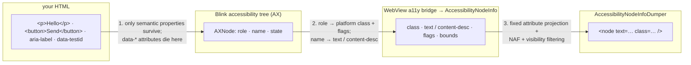

`adb shell uiautomator dump` is the automation workhorse: one command, an XML file, "here's what's on screen". But point it at an app that shows web content in a `WebView` and the relationship between your HTML and that XML gets strange. This post is a hands-on study of exactly how HTML becomes accessibility-tree XML, verified live against a physical device.

## TL;DR

- `uiautomator dump` serialises the **Android accessibility tree** (`AccessibilityNodeInfo`) to XML — the same tree Appium's UiAutomator2 driver and native automation read.
- **The WebView's part of that tree is built lazily.** After a cold start, the *first* dump shows only a bare `<node class="android.webkit.WebView">`; the *second* dump has your whole page. This is why "content isn't in the XML until I run the dump again" happens — and why a modal or late-appearing component seems to "sometimes" vanish. Setting `--force-renderer-accessibility` — a WebView command-line flag (see Gotcha 1) — makes the first dump complete.
- **The mapping** (on the WebView version tested): `text`→`text`; `aria-label`→`text` (not `content-desc`, on this build); roles→platform classes (`Button`, `CheckBox`, `EditText`, `SeekBar`, `Image`); `sr-only` text is *present*; `aria-hidden` and `display:none` are *absent*; HTML `id`→`resource-id` (verified on WebView 115, Chrome 151/153 and Vanadium 152; it regressed in Chrome 120–126 and Chromium fixed it in M127, 2024 — one residual caveat in Gotcha 3); **`data-testid` never appears**.
- **Two myths, disproved**: you do *not* need a debuggable app to read the dump (a release build dumps fine), and you *cannot* surface `data-testid` into the XML.
- **Bounds are device pixels**, and the conversion factor depends on your device's density (including a density override, if you have one set).

## What `uiautomator dump` actually is

One command, three layers:

1. `uiautomator` runs on the device as the `shell` user and opens a connection to the accessibility framework (`UiAutomation`).
2. It grabs the root node of the **active window** and walks the `AccessibilityNodeInfo` tree — the same tree native automation, TalkBack and other accessibility services read.
3. AOSP's `AccessibilityNodeInfoDumper` serialises it to a flat `<node …/>` XML with a **fixed attribute set**:

| Attribute | Meaning |
|---|---|
| `text` | The node's primary text |
| `content-desc` | Accessibility description |
| `resource-id` | Android view id (see the `id` story below) |
| `class` | The platform view class (`android.widget.TextView`, …) |
| `package` | Owning app package |
| `checkable`/`checked`/`clickable`/`enabled`/`focusable`/`focused`/`scrollable`/`long-clickable`/`selected` | State flags |
| `password` | Text is a password (masked) |
| `bounds` | **Device-pixel** rectangle, `[left,top][right,bottom]` |
| `NAF` | "Not Accessibility Friendly" — clickable but no text/description |

By default the dump covers **only the active window** (`getRootInActiveWindow`). `uiautomator dump --windows` switches to *all* windows and produces a different shape: `<displays><display><window title="…" bounds="…" active="true">…`.

This matters because, on the native side, a `WebView` is just one view node — and *everything else you see in the dump for a web page are accessibility nodes the WebView fabricates for your HTML*. That fabricated subtree is what this post maps.

## The pipeline, in one picture

Between your HTML and the XML there are three hops, and each one drops information:

<div style="width: 100%; overflow: auto;">



</div>

1. **DOM → Blink AX tree.** Blink keeps an accessibility tree of *semantic* properties: role, name, states. Non-semantic attributes — `data-*`, `class`, inline style — never enter it. Your `data-testid` is gone before step two even starts.
2. **AX tree → `AccessibilityNodeInfo`.** The WebView's accessibility bridge maps roles onto Android concepts: `AXRole::BUTTON` → `isClickable()` + `className="android.widget.Button"`, `AXRole::CHECK_BOX` → `isCheckable()/isChecked()`, `AXRole::TEXT_BOX`/`PASSWORD_FIELD` → `EditText` + `password` flag. The accessible name (from text content, `aria-label`, `alt`, …) lands in `text` or `content-desc` — on the WebView build tested here, `aria-label` landed in **`text`**.
3. **NodeInfo → XML.** The dumper projects onto its fixed attribute list, marks unlabeled-but-clickable nodes `NAF="true"`, and applies visibility checks. Bounds are emitted in raw device pixels.


## The mapping table

The full dump is large, so instead of inlining it, here are two files you can open in a new tab:

- <a href="artifacts/dump.html" target="_blank" rel="noopener">Open the HTML — the full gallery page</a>
- <a href="artifacts/dump.xml" target="_blank" rel="noopener">Open the XML — the full warm dump</a>

Then the same dump, broken out one element at a time — HTML on the left, its dumped node on the right. (The last three cases, 32–34, come from a separate screen-reader-enabled capture — they aren't in the warm `dump.xml`; the worked example below walks through them.)

<Collapsible label="Expand to see all 33 mapping cases">

<HtmlXmlCompare
  label={"Plain text"}
  html={"<p>\n  Hello world, plain text.\n</p>"}
  xml={"<node\n  text=\"Hello world, plain text.\"\n  resource-id=\"\"\n  class=\"android.widget.TextView\"\n  package=\"com.example.androidapp\"\n  content-desc=\"\"\n  checkable=\"false\"\n  checked=\"false\"\n  clickable=\"false\"\n  enabled=\"true\"\n  focusable=\"false\"\n  focused=\"false\"\n  scrollable=\"false\"\n  long-clickable=\"false\"\n  password=\"false\"\n  selected=\"false\"\n  bounds=\"[29,415][1051,450]\"\n  />"}
/>

<HtmlXmlCompare
  label={"Heading"}
  note={"the heading role is not exposed; there is no heading attribute in the dump at all"}
  html={"<h3>\n  Case Two Heading\n</h3>"}
  xml={"<node\n  text=\"Case Two Heading\"\n  resource-id=\"\"\n  class=\"android.widget.TextView\"\n  \u2026\n  bounds=\"[29,588][1051,627]\"\n  />"}
/>

<HtmlXmlCompare
  label={"Link"}
  note={"a clickable wrapper carries the link text as <code>content-desc</code> around a text child; the serialisation varies between runs (sometimes a plain, non-clickable <code>TextView</code>)"}
  html={"<a href=\"https://example.com\">\n  A link to example.com\n</a>"}
  xml={"<node\n  text=\"\"\n  resource-id=\"\"\n  class=\"android.view.View\"\n  content-desc=\"A link to example.com\"\n  clickable=\"true\"\n  focusable=\"true\"\n  bounds=\"[29,745][296,780]\"\n  >\n  <node\n    text=\"A link to example.com\"\n    class=\"android.widget.TextView\"\n    \u2026\n    />\n</node>"}
/>

<HtmlXmlCompare
  label={"Button"}
  html={"<button type=\"button\">\n  Send\n</button>"}
  xml={"<node\n  text=\"Send\"\n  resource-id=\"\"\n  class=\"android.widget.Button\"\n  \u2026\n  clickable=\"true\"\n  focusable=\"true\"\n  \u2026\n  bounds=\"[29,898][121,943]\"\n  />"}
/>

<HtmlXmlCompare
  label={"Checkbox with label"}
  note={"the label text is merged onto the checkbox node"}
  html={"<label>\n  <input type=\"checkbox\" checked>\n  Accept terms\n</label>"}
  xml={"<node\n  text=\"Accept terms\"\n  resource-id=\"\"\n  class=\"android.widget.CheckBox\"\n  \u2026\n  checkable=\"true\"\n  checked=\"true\"\n  clickable=\"true\"\n  \u2026\n  />"}
/>

<HtmlXmlCompare
  label={"Radio"}
  html={"<label>\n  <input type=\"radio\" name=\"r\" checked>\n  Option A\n</label>"}
  xml={"<node\n  text=\"Option A\"\n  \u2026\n  class=\"android.widget.RadioButton\"\n  \u2026\n  checkable=\"true\"\n  checked=\"true\"\n  \u2026\n  />"}
/>

<HtmlXmlCompare
  label={"Text input"}
  note={"the value becomes <code>text</code>"}
  html={"<input type=\"text\" value=\"Type here\" autocomplete=\"off\">"}
  xml={"<node\n  text=\"Type here\"\n  \u2026\n  class=\"android.widget.EditText\"\n  \u2026\n  clickable=\"true\"\n  focusable=\"true\"\n  \u2026\n  />"}
/>

<HtmlXmlCompare
  label={"Password input"}
  note={"the value is masked and <code>password=\"true\"</code> is set"}
  html={"<input type=\"password\" value=\"secret\">"}
  xml={"<node\n  text=\"\u2022\u2022\u2022\u2022\u2022\u2022\"\n  \u2026\n  class=\"android.widget.EditText\"\n  \u2026\n  password=\"true\"\n  \u2026\n  />"}
/>

<HtmlXmlCompare
  label={"Textarea"}
  html={"<textarea rows=\"2\">\n  Multiline text area content\n</textarea>"}
  xml={"<node\n  text=\"Multiline text area content\"\n  \u2026\n  class=\"android.widget.EditText\"\n  \u2026\n  />"}
/>

<HtmlXmlCompare
  label={"Select"}
  note={"the selected option becomes <code>text</code> on a plain <code>View</code>"}
  html={"<select>\n  <option>\n    One\n  </option>\n  <option>\n    Two\n  </option>\n</select>"}
  xml={"<node\n  text=\"One\"\n  \u2026\n  class=\"android.view.View\"\n  \u2026\n  clickable=\"true\"\n  focusable=\"true\"\n  \u2026\n  />"}
/>

<HtmlXmlCompare
  label={"Image with alt"}
  note={"<code>alt</code> maps to <code>text</code>"}
  html={""}
  xml={"<node\n  text=\"A red rectangle\"\n  \u2026\n  class=\"android.widget.Image\"\n  \u2026\n  />"}
/>

<HtmlXmlCompare
  label={"Image without alt"}
  note={"no description, so the <code>src</code> (an inline SVG data-URI) is the fallback name — and only its tail, <code>svg&gt;</code>, leaked into <code>text</code> (a quirk of inline data-URI images without <code>alt</code>)"}
  html={"<rect width='60' height='30' fill='%2345a'/></svg>\">"}
  xml={"<node\n  text=\"svg&gt;\"\n  \u2026\n  class=\"android.widget.Image\"\n  \u2026\n  />"}
/>

<HtmlXmlCompare
  label={"`aria-label` on a generic element"}
  note={"the label became <code>text</code> and replaced the inner text; <code>content-desc</code> stays empty"}
  html={"<div role=\"img\" aria-label=\"Company logo\">\n  Logo placeholder\n</div>"}
  xml={"<node\n  text=\"Company logo\"\n  \u2026\n  class=\"android.widget.Image\"\n  \u2026\n  />"}
/>

<HtmlXmlCompare
  label={"`aria-label` with inner text"}
  note={"the label wins"}
  html={"<div role=\"button\" aria-label=\"Close dialog\">\n  X\n</div>"}
  xml={"<node\n  text=\"Close dialog\"\n  \u2026\n  class=\"android.widget.Button\"\n  \u2026\n  clickable=\"true\"\n  \u2026\n  />"}
/>

<HtmlXmlCompare
  label={"`role=\"button\"`"}
  html={"<div role=\"button\" tabindex=\"0\">\n  Fake button div\n</div>"}
  xml={"<node\n  text=\"Fake button div\"\n  \u2026\n  class=\"android.widget.Button\"\n  \u2026\n  clickable=\"true\"\n  focusable=\"true\"\n  \u2026\n  />"}
/>

<HtmlXmlCompare
  label={"`role=\"checkbox\"` + `aria-checked`"}
  html={"<div role=\"checkbox\" aria-checked=\"true\" tabindex=\"0\">\n  Custom checkbox\n</div>"}
  xml={"<node\n  text=\"Custom checkbox\"\n  \u2026\n  class=\"android.widget.CheckBox\"\n  \u2026\n  checkable=\"true\"\n  checked=\"true\"\n  clickable=\"true\"\n  \u2026\n  />"}
/>

<HtmlXmlCompare
  label={"`role=\"heading\"`"}
  note={"the role is lost"}
  html={"<div role=\"heading\" aria-level=\"2\">\n  Custom heading role\n</div>"}
  xml={"<node\n  text=\"Custom heading role\"\n  \u2026\n  class=\"android.widget.TextView\"\n  \u2026\n  />"}
/>

<HtmlXmlCompare
  label={"`sr-only` text"}
  note={"present in the tree (correct WCAG behaviour)"}
  html={"<span class=\"sr-only\">\n  Visually hidden but accessible text\n</span>"}
  xml={"<node\n  text=\"Visually hidden but accessible text\"\n  \u2026\n  class=\"android.widget.TextView\"\n  \u2026\n  />"}
/>

<HtmlXmlCompare
  label={"`aria-hidden=\"true\"`"}
  note={"absent from the dump (correct)"}
  html={"<div aria-hidden=\"true\">\n  This whole subtree is hidden from accessibility\n</div>"}
  xml={"<!-- no node at all -->"}
/>

<HtmlXmlCompare
  label={"`display:none`"}
  note={"absent from the dump (correct)"}
  html={"<div style=\"display:none\">\n  Display none, not in the tree\n</div>"}
  xml={"<!-- no node at all -->"}
/>

<HtmlXmlCompare
  label={"HTML `id`"}
  note={"maps to <code>resource-id</code> on current builds (WebView 115, Chrome 151/153, Vanadium 152 — all verified); note it regressed in Chrome 120–126 and Chromium fixed it in M127, see Gotcha 3"}
  html={"<div id=\"unique-element-id\">\n  I have an HTML id\n</div>"}
  xml={"<node\n  text=\"I have an HTML id\"\n  resource-id=\"unique-element-id\"\n  \u2026\n  />"}
/>

<HtmlXmlCompare
  label={"`data-testid`"}
  note={"never appears; <code>resource-id</code> stays empty"}
  html={"<div data-testid=\"my-test-hook\">\n  I have a data-testid\n</div>"}
  xml={"<node\n  text=\"I have a data-testid\"\n  resource-id=\"\"\n  \u2026\n  />"}
/>

<HtmlXmlCompare
  label={"Adjacent spans"}
  note={"merged into a single text node"}
  html={"<p>\n  <span>\n    Left span,\n  </span>\n  <span>\n    right span.\n  </span>\n</p>"}
  xml={"<node\n  text=\"Left span, right span.\"\n  \u2026\n  />"}
/>

<HtmlXmlCompare
  label={"List items"}
  note={"each bullet is its own <code>View</code> with <code>text=\"• \"</code>"}
  html={"<ul>\n  <li>\n    First item\n  </li>\n  <li>\n    Second item\n  </li>\n</ul>"}
  xml={"<node\n  text=\"\u2022 \"\n  \u2026\n  class=\"android.view.View\"\n  \u2026\n  />\n<node\n  text=\"First item\"\n  \u2026\n  class=\"android.widget.TextView\"\n  \u2026\n  />\n<node\n  text=\"\u2022 \"\n  \u2026\n  class=\"android.view.View\"\n  \u2026\n  />\n<node\n  text=\"Second item\"\n  \u2026\n  class=\"android.widget.TextView\"\n  \u2026\n  />"}
/>

<HtmlXmlCompare
  label={"Table cells"}
  note={"plain <code>View</code>, not <code>TextView</code>"}
  html={"<table>\n  <tr>\n    <th>\n      Name\n    </th>\n    <th>\n      Value\n    </th>\n  </tr>\n  <tr>\n    <td>\n      alpha\n    </td>\n    <td>\n      1\n    </td>\n  </tr>\n  <tr>\n    <td>\n      beta\n    </td>\n    <td>\n      2\n    </td>\n  </tr>\n</table>"}
  xml={"<node\n  text=\"Name\"\n  \u2026\n  class=\"android.view.View\"\n  \u2026\n  />\n<node\n  text=\"Value\"\n  \u2026\n  class=\"android.view.View\"\n  \u2026\n  />\n<node\n  text=\"alpha\"\n  \u2026\n  class=\"android.view.View\"\n  \u2026\n  />\n<node\n  text=\"1\"\n  \u2026\n  class=\"android.view.View\"\n  \u2026\n  />\n<node\n  text=\"beta\"\n  \u2026\n  class=\"android.view.View\"\n  \u2026\n  />\n<node\n  text=\"2\"\n  \u2026\n  class=\"android.view.View\"\n  \u2026\n  />"}
/>

<HtmlXmlCompare
  label={"Range input"}
  note={"<code>SeekBar</code> with the value as text"}
  html={"<input type=\"range\" min=\"0\" max=\"10\" value=\"5\">"}
  xml={"<node\n  text=\"5\"\n  \u2026\n  class=\"android.widget.SeekBar\"\n  \u2026\n  clickable=\"true\"\n  focusable=\"true\"\n  \u2026\n  />"}
/>

<HtmlXmlCompare
  label={"`<details><summary>`"}
  html={"<details>\n  <summary>\n    Expand me\n  </summary>\n  Hidden details content.\n</details>"}
  xml={"<node\n  text=\"Expand me\"\n  \u2026\n  class=\"android.view.View\"\n  \u2026\n  clickable=\"true\"\n  focusable=\"true\"\n  \u2026\n  />"}
/>

<HtmlXmlCompare
  label={"`contenteditable`"}
  html={"<div contenteditable=\"true\">\n  Editable content\n</div>"}
  xml={"<node\n  text=\"Editable content\"\n  \u2026\n  class=\"android.widget.EditText\"\n  \u2026\n  />"}
/>

<HtmlXmlCompare
  label={"JS modal"}
  note={"the <code>role=\"dialog\"</code>/<code>aria-modal</code>/<code>aria-label</code> on the container produce nothing; the inner title, body and buttons appear as plain nodes"}
  html={"<div id=\"modal-box\" role=\"dialog\" aria-modal=\"true\" aria-label=\"Example modal\">\n  <h3>\n    Modal title\n  </h3>\n  <p>\n    Modal body text.\n  </p>\n  <button type=\"button\" id=\"modal-close\">\n    Close\n  </button>\n</div>"}
  xml={"<node\n  text=\"Modal title\"\n  \u2026\n  class=\"android.widget.TextView\"\n  \u2026\n  />\n<node\n  text=\"Modal body text.\"\n  \u2026\n  class=\"android.widget.TextView\"\n  \u2026\n  />\n<node\n  text=\"Close\"\n  resource-id=\"modal-close\"\n  \u2026\n  class=\"android.widget.Button\"\n  \u2026\n  clickable=\"true\"\n  \u2026\n  />"}
/>

<HtmlXmlCompare
  label={"Off-screen content (below the fold)"}
  note={"the button below the fold stays in the tree, but with <code>bounds=\"[0,0][0,0]\"</code>"}
  html={"<button type=\"button\" id=\"open-modal\">\n  Open modal\n</button>"}
  xml={"<node\n  text=\"Open modal\"\n  resource-id=\"open-modal\"\n  \u2026\n  class=\"android.widget.Button\"\n  \u2026\n  clickable=\"true\"\n  \u2026\n  bounds=\"[0,0][0,0]\"\n  />"}
/>


<HtmlXmlCompare
  label={"sr-only sentence + aria-hidden breakdown (case 32)"}
  note={"only the <code>sr-only</code> sentence appears; the <code>aria-hidden</code> breakdown (<code>Contact:</code>, <code>James Roger</code>, <code>23</code>, <code>emails</code>) is absent — so <code>23</code> is unreachable"}
  html={"<div>\n  <span class=\"sr-only\">Contact James Roger has 23 unread emails</span>\n  <div aria-hidden=\"true\">\n    <span>Contact:</span><span>James Roger</span>\n    <span>23</span><span>emails</span>\n  </div>\n</div>"}
  xml={"<node\n  text=\"Contact James Roger has 23 unread emails\"\n  resource-id=\"\"\n  class=\"android.widget.TextView\"\n  …\n  bounds=\"[0,0][0,0]\"\n  />"}
/>

<HtmlXmlCompare
  label={"<dl> with aria-label (case 33)"}
  note={"the <code>&lt;dl&gt;</code> becomes a <code>ListView</code> whose text is the <code>aria-label</code> sentence; every <code>&lt;dt&gt;</code>/<code>&lt;dd&gt;</code> keeps its own node — including <code>23</code>. (But the <code>aria-label</code> on a generic <code>&lt;dl&gt;</code> is exposed in the tree only, not announced by screen readers — see the worked example)"}
  html={"<dl aria-label=\"Contact James Roger has 23 unread emails\">\n  <dt>Contact</dt><dd>James Roger</dd>\n  <dt>Emails</dt><dd>23</dd>\n</dl>"}
  xml={"<node\n  text=\"Contact James Roger has 23 unread emails\"\n  resource-id=\"\"\n  class=\"android.widget.ListView\"\n  …\n  bounds=\"[0,0][0,0]\"\n  >\n  <node\n  text=\"Contact\"\n  resource-id=\"\"\n  class=\"android.view.View\"\n  …\n  bounds=\"[0,0][0,0]\"\n  />\n  <node\n  text=\"James Roger\"\n  resource-id=\"\"\n  class=\"android.view.View\"\n  …\n  bounds=\"[0,0][0,0]\"\n  />\n  <node\n  text=\"Emails\"\n  resource-id=\"\"\n  class=\"android.view.View\"\n  …\n  bounds=\"[0,0][0,0]\"\n  />\n  <node\n  text=\"23\"\n  resource-id=\"\"\n  class=\"android.view.View\"\n  …\n  bounds=\"[0,0][0,0]\"\n  />\n</node>"}
/>

<HtmlXmlCompare
  label={"role=\"group\" with aria-label (case 34)"}
  note={"the container keeps the <code>aria-label</code> sentence as its text, but the individual values collapse away — <code>23</code> is unreachable as a discrete value"}
  html={"<div role=\"group\" aria-label=\"Contact James Roger has 23 unread emails\">\n  <span>Contact:</span><span>James Roger</span>\n  <span>23</span><span>emails</span>\n</div>"}
  xml={"<node\n  text=\"Contact James Roger has 23 unread emails\"\n  resource-id=\"\"\n  class=\"android.view.View\"\n  …\n  bounds=\"[0,0][0,0]\"\n  >\n  <node\n  text=\"\"\n  resource-id=\"\"\n  class=\"android.view.View\"\n  …\n  bounds=\"[0,0][0,0]\"\n  />\n</node>"}
/>
</Collapsible>

A few patterns worth internalising:

- **The name wins.** Wherever the accessible name comes from (`aria-label`, `alt`, text content, a label), it becomes the node's `text` — and `aria-label` *replaces* inner text on this build. `content-desc` stayed empty everywhere in the web subtree except link wrapper nodes.
- **Roles are lossy.** Control roles become platform classes and flags (`Button`, `CheckBox`, `EditText`, `SeekBar`, `Image`, `RadioButton`). Roles without an Android analogue — `heading`, `dialog`, `main`, `banner` — simply vanish.
- **`sr-only` present, `aria-hidden`/`display:none` absent.** Both are *correct* WCAG-conformance behaviour, not bugs. This becomes important later.
- **The dump is not a stable mirror.** A link serialised as a clickable wrapper+child in one dump and a plain `TextView` in another. Tree construction varies run to run — one more reason to treat it as a snapshot, not a DOM.

## Gotchas that look like bugs

### 1. The first dump is incomplete: the WebView's accessibility tree is lazy

This is the finding behind "content doesn't appear until I run the dump a second time" — and, very often, behind "my modal is sometimes missing from the XML".

The WebView builds its accessibility tree **lazily, on first access**. `uiautomator dump` opens a fresh connection each time, so:

- After a cold start, dump #1 (even 10 s after the page settled) returns **8 nodes**: the app chrome plus a bare `<node NAF="true" … class="android.webkit.WebView" …>` with no children.
- Dump #2, seconds later, returns **90 nodes**: the whole gallery.

Verified A/B on the same settle time:

```text
no flag, first dump:  8 nodes, 0 gallery text   ← bare WebView
no flag, second dump: 90 nodes, gallery text    ← populated
```

Two control experiments rule out the obvious explanations:

- **It's not a general `uiautomator` warm-up.** A native app (Settings) dumps 92 nodes on the *first* try.
- **Enabling the screen reader does not fix it.** With TalkBack enabled and running, the first dump is still 8 nodes; the second dump is 90. The lazy tree is per-WebView-and-per-connection, not a system-wide toggle.

The reliable fix is a WebView **command-line flag**. WebView isn't launched from a
terminal, so it can't receive `argv` like a normal process. Instead, Chromium checks
a fixed debug path at every startup: if `/data/local/tmp/webview-command-line`
exists, its contents are treated as the process's command line. The file doesn't
exist by default — you create it with a single `echo` and delete it when done.
`/data/local/tmp/` is the one spot under the protected `/data` partition that
`adb shell` can write to **without root**, which is why the debug hook lives there.
Three parsing details: the **first token is ignored** (that's the `_` placeholder);
the file is only read **at process start**, so the app must be force-stopped for the
flag to apply; and it's read by the *app's* WebView process, not `shell`, so the file
must be **world-readable** — a default `echo` gives `0644`; if your shell's umask is
stricter, `chmod 0664` it or the flag is silently ignored.

```bash
adb shell "echo '_ --force-renderer-accessibility' > /data/local/tmp/webview-command-line"
adb shell chmod 0664 /data/local/tmp/webview-command-line   # read by the app, not shell
adb shell am force-stop com.example.androidapp   # restart the app so the flag is read
```

With the flag in place, the *first* cold dump returns 90 nodes. Don't confuse the
file with `/data/local/tmp/chrome-command-line` — that sibling path is read only by
the Chrome *browser* app, not by embedded WebViews; using the wrong name silently
does nothing. And the flag applies **device-wide**: leave the file in place and every
WebView app keeps the behaviour. Remove it (and force-stop again) when you're done —
the cleanup command is in *Reproducing*.

**Caveat, verified while testing:** on a stock **`user`** build the file is ignored.
Chromium gates command-line flags to `userdebug`/`eng` images, and the OnePlus 6 used
here is `userdebug` — on a Pixel 7 Pro (`ro.build.type=user`) the same file did
nothing and the first dump stayed empty. On a user build your only option is to warm
the tree (dump twice); the flag is a userdebug/eng tool.

This also explains the modal mystery. The component is there; its tree just isn't materialised yet. On a *warm* tree, JS modals are rock-solid:

- 15 consecutive dumps of a screen with the modal open: dump #1 empty (cold), dumps #2–#15 all 95 nodes with the modal present.
- 10 *separate* dump invocations once warm: 10/10 present.
- Open → close → reopen → each reflected on the very next dump.
- The tree survives 60 s of idle and app background/foreground cycles.

So if you're seeing "sometimes found, sometimes not", the usual culprit is an automation loop that opens a fresh dump per action — each fresh WebView (or freshly restarted app) costs you one empty first dump. Warm the tree once, or set the flag, and it stops.

One more trap in the same neighbourhood: if the screen locks between steps, `uiautomator dump` either returns the **keyguard** hierarchy or fails with `ERROR: null root node returned by UiTestAutomationBridge.` Keep the screen awake and unlocked during automation.

### 2. Bounds are device pixels — and they go stale after scrolling

Dump bounds are raw device pixels. CSS pixels = device px ÷ (density ÷ 160). On the test device the user-set density override is 314, so the factor is **1.9625**:

- `window.innerWidth` (asked over the debugging socket): **551** CSS px.
- The WebView container's dumped width: **1080** device px.
- `551 × 1.9625 ≈ 1081` ✓.

Beware density overrides: they silently change the CSS↔px factor, which breaks hard-coded tap coordinates.

Scrolling is weirder. After a swipe scroll (verified: `window.scrollY` = 1768 of 3439), the *whole* web subtree's bounds collapsed to `[0,0][0,0]` — top content and newly-visible bottom content alike — even though every node stayed in the tree. Scrolling back to the top restored real bounds. Treat node bounds as a snapshot that needs a settle/refresh after scroll, not as live geometry.

### 3. `id` → `resource-id`: works on current builds, regressed once in 2024

Every engine we tested surfaces the HTML `id` attribute as the node's `resource-id`:

- WebView **115** (Google Android System WebView, the OnePlus 6)
- Chrome **151** (an embedded WebView, no accessibility service)
- Chrome **153** (the browser, on the second test device)
- Vanadium WebView **152** (same device)

Chromium confirmed this was a regression and fixed it in **M127** (July 2024): the CL *"Always serialize html id for ax_objects"* ([7caa57bd5](https://chromium.googlesource.com/chromium/src/+/7caa57bd549d772763064a30a7596d96e9d7ca68)) re-added the export explicitly *"to unblock third party testing frameworks on Android"* — closing [Chromium issue #328681381](https://issues.chromium.org/328681381), which the Appium project had filed ([appium/appium#19848](https://github.com/appium/appium/issues/19848)). So the breakage covered roughly Chrome/WebView **120–126**; 127+ exports it again, and every 2026 build we tested does too.

One residual nuance, separate from that regression: with an accessibility service already running, a fresh dump can still miss `resource-id`. Chromium logged this separately as [issue #357573053](https://issues.chromium.org/357573053) (suspected cause: HTML-`id` serialisation gated by the tree's AX mode; still open, P3, as of 2026). The export is conditioned on how the tree is built, not only on the WebView version.

For automation that must survive WebView updates, `resource-id` is still not the safest handle — it has broken once. The durable handle is **role + accessible name** — the `text`/`content-desc` a screen reader announces:

- **Developer:** give each control a stable, unique accessible name — real visible text for text controls, `aria-label`/`alt` for icon-only controls, and no two controls sharing a name. A tester can then locate a `button` named *Save*.
- **Tester:** query `role` + name instead of an `id`.
- **If a DOM handle (`id`/`data-testid`) is genuinely required**, that is the DOM path, not the a11y tree — it exists only in the `WEBVIEW`/chromedriver context (or a release-signed QA flavour with the debugging socket). Don't fake handles into the a11y tree (e.g. an `aria-label` set to an internal id, or sr-only id text).

| Automation engine | Handle to use | Handle to avoid |
|---|---|---|
| A11y tree (`uiautomator dump` / `NATIVE_APP`) | role + accessible name (`text` / `content-desc`) | `resource-id` from HTML `id` (regressed once, 2024); `data-testid` |
| DOM (`WEBVIEW` / chromedriver) | `id`, `data-testid`, real selectors | — |

One related proposal worth resisting: *"let's put an `id` on every element (or build tooling that auto-annotates them) so the testers always have a handle."* Blanket annotation is a maintenance tax — across many modules and teams the ids drift, go unused, and couple tests to DOM structure instead of behaviour. The industry consensus is the opposite: [query by role, label and text first](https://testing-library.com/docs/queries/about), prefer `data-testid` only where semantics genuinely can't be used (it sits last in the standard [query priority](https://testing-library.com/docs/queries/about)), and [locate by role](https://playwright.dev/docs/locators) in browser automation. A test handle is the fallback, not the default.

### 4. `content-desc` and text are not what you might expect

On this WebView build, `aria-label` maps to `text`, not `content-desc`, and it replaces inner text. Links are the exception, sometimes emitting a wrapper whose `content-desc` holds the link text. Neither is consistent across versions. If you're writing automation against web content, query by the *name you can see* (the accessible name) rather than assuming which attribute it landed in.

## The two myths

### Myth 1: "the app must be debuggable to read the dump"

False. The a11y path does not need any debug flag. Proof from the study: we built the launcher as a **release APK** — `android:debuggable` absent, no `DEBUGGABLE` in `dumpsys package` flags — installed it, and `uiautomator dump` returned the full page tree exactly as the debug build did.

Where does the myth come from? **WebView *remote debugging*** (the Chrome DevTools / DOM path) does care about debuggability — and people conflate the two. The dump you get from `uiautomator` is the accessibility tree, which has nothing to do with debugging sockets. (There is also a partial conflation with the lazy tree: when the first dump came back as a bare `WebView`, the assumption "it must need special flags" was natural.)

### Myth 2: "we can surface `data-testid` into the XML"

False, and structurally impossible. `data-testid` is a non-semantic attribute — Blink's accessibility tree only carries semantic properties (role, name, state), so `data-testid` never enters it. In the study, the element with `data-testid="my-test-hook"` produced a node whose `resource-id` was empty and whose XML contained no trace of the attribute.

Where `data-testid` *does* work is the **DOM path** (see below) — but only when the WebView actually exposes its debugging socket, which is exactly the debuggable/socket story everyone is really confused about.

## Two ways automation reads your app

Automation frameworks on Android have **two engines with different contracts**:

| | `NATIVE_APP` (accessibility tree) | `WEBVIEW` (DOM over DevTools protocol) |
|---|---|---|
| Source | The same `AccessibilityNodeInfo` tree `uiautomator dump` reads | The real HTML DOM, served over the WebView's debugging socket |
| Works on | Any app — debug **or release**, no special build | Only when the WebView exposes its debugging socket |
| What you get | `text`, roles→classes, flags, bounds — but **no DOM**, no `data-testid`, no document structure | Full DOM: real selectors, `data-testid`, computed styles |
| Requires | Nothing beyond the app itself | `WebView.setWebContentsDebuggingEnabled(true)` — auto-on for **debuggable** apps since WebView 113 — **or** a debug-enabled build |

The production-build rule, then, is: **the a11y tree works on a production APK; the real DOM only exists if the WebView debugging socket is on.** "The production build's HTML isn't accessible" is a *build/tooling* property (the socket), not something any HTML change can fix. If you genuinely need DOM automation against a production-representative build, the path is a **release-signed QA flavour** with web debugging enabled — still signed, still UAT-eligible, but deliberately not the exact production binary.

One nuance the study surfaced: the socket gate is *per-device*, not per-app-config. This test device is a **userdebug** build (`ro.build.type=userdebug`, `ro.debuggable=1`) — and on userdebug/eng images and emulators, WebView debugging is **enabled for every app by default**, so our non-debuggable release APK exposed a working DevTools socket anyway. On a stock **user** build it would not. That asymmetry is why you must verify DOM-automation assumptions on a device that actually mirrors production.

The a11y path, by contrast, was identical on both builds: no debug flag, no socket, no special config.

## Test what users experience — without warping the markup for a scraper

The a11y tree *is* the structure users experience: TalkBack reads it, screen readers navigate it, accessibility services act on it. So the established practice is to query it the way a user would — by **role, name and accessible text**. That is Testing Library's principle: *"the more your tests resemble the way your software is used, the more confidence they can give you."* Role-based locators and accessibility-tree snapshot assertions are the default in mainstream browser automation, and automated accessibility scans are a standard CI gate, complemented by manual and real-user testing.

Caveat: many resilient end-to-end suites *do* use `data-testid` — it is a legitimate escape hatch **in DOM contexts**. It just never exists in the accessibility tree, which is exactly the seam this post maps.

The same view exposes a guardrail. `sr-only` text is in the tree; `aria-hidden` content is not. Both are *correct* — they are the WCAG conformance mechanism. An automation team that "fixes" a missing locator by copying marketing text out of `aria-hidden`, or by turning a decorative image into a real one, is warping production semantics to satisfy a scraper — a classic case of [test-induced design damage](https://dhh.dk/2014/test-induced-design-damage.html) (a phrase coined by DHH in 2014; [ThoughtWorks published a balanced counterpoint](https://www.thoughtworks.com/insights/blog/test-induced-design-damage-fallacy-or-reality) the same year). The production markup should serve users first; automation locators should be built on top of the same semantics, not the other way around.

| Do | Don't |
|---|---|
| Keep `sr-only` text — it's the WCAG mechanism for making content available to assistive tech, and (as this post shows) to the a11y tree | Copy text out of `aria-hidden` elements just so a scraper can find it |
| Mark genuinely decorative images with empty `alt` or `aria-hidden` | Promote a decorative image to a meaningful one only to satisfy a locator |
| Fix a missing locator by fixing the semantics (a real label, a real accessible name) | Change the DOM structure only to make a scraper's selector match |

## The `sr-only` / `aria-hidden` split: a worked example

A common screen-reader requirement is one clean announcement — *"Contact James Roger has 23 unread emails"* — built with the classic split:

```html
<div>
  <span class="sr-only">Contact James Roger has 23 unread emails</span>
  <div aria-hidden="true">
    <span>Contact:</span><span>James Roger</span>
    <span>23</span><span>emails</span>
  </div>
</div>
```

The announcement is perfect. The problem: `aria-hidden="true"` removes the entire breakdown from the accessibility tree, so neither a screen reader nor a11y-tree automation can reach the individual values. Verified in the WebView dump: the tree contains the `sr-only` sentence and nothing else from the breakdown — no `Contact:`, no `23`.

The fix keeps *both* the sentence and the data — but not by putting the announcement on the container. `aria-label` on a `<dl>` is exposed in the accessibility tree (that's why the dump shows it), yet a screen reader won't announce it: `<dl>` maps to a generic role that doesn't support author-provided names, so TalkBack skips the label. A container-level `aria-label` only works on roles that can be named (widgets, landmarks, `group`, …).

The pattern that keeps both is to keep the announcement as *real text* and stop hiding the data:

```html
<span class="sr-only">Contact James Roger has 23 unread emails</span>
<dl>
  <dt>Contact</dt><dd>James Roger</dd>
  <dt>Emails</dt><dd>23</dd>
</dl>
```

The `sr-only` sentence is real content — it stays in the tree and *is* read aloud. The `<dl>` still surfaces as a `ListView`, and every `<dt>`/`<dd>` keeps its own node — `Contact`, `James Roger`, `Emails`, `23` — the same structural mapping case 33 verified, minus a container label nobody announces anyway. Both goals met: one clean announcement, and every value reachable.

`role="group"` + `aria-label` on plain spans is a different failure: the container keeps the sentence as its text (and `group` *does* support naming), but the individual values collapse away, so `23` is unreachable as a discrete value. The structure has to be real (`<dl>`, lists, table rows), not roles layered onto generic `div`s.

**Rule of thumb:** if a value is data someone might need to reference — query, navigate, or test — it does not belong inside `aria-hidden`. And don't put announcements in `aria-label` on generic containers: only roles that support naming carry an author-provided name. For a plain-text announcement, use real text — that is exactly what `sr-only` is for.

## How UAT should run

- Distribute a **signed release candidate** through your platform's testing tracks (e.g. the store console's internal/closed tracks, or the equivalent for your distribution channel), not a debug build.
- Automate against *that* artifact via the **native a11y tree** — it works on release, no debug flag, no socket.
- Build a release-signed QA flavour **only** if you have a genuine DOM-automation need (and accept it is not byte-identical to production).
- Make **accessibility an explicit UAT acceptance criterion**: automated scans in CI, manual passes with the platform screen reader, and real-user checks — not just "does the locator find it".

## Practical checklist

- **Want the WebView subtree reliably?** Set `_ --force-renderer-accessibility` in the WebView command-line file (`/data/local/tmp/webview-command-line`, Gotcha 1) and restart the app; remove the file when done — the flag is device-wide. Otherwise expect the first dump of each fresh WebView to be empty — re-dump or warm the tree once.
- **Target by accessible name** (`text` / `content-desc`) and role-derived classes — not `resource-id` (it regressed once, in 2024) and never `data-testid`.
- **Bounds are device px.** Compute the CSS↔px factor from the live density (including overrides), and treat bounds as stale after scroll.
- **Keep the screen awake and unlocked** between steps; use `uiautomator dump --windows` when the thing you want lives in another window.
- **Verify on a production-representative device.** If your automation depends on the DOM path, remember userdebug/eng devices and emulators enable the socket for all apps; stock user builds do not.

## Reproducing the results

Environment: any device with a WebView launcher app and `adb` (this study used the author's [simple WebView launcher](https://github.com/amoshydra/android-webview-launcher), which just loads a URL you pass it), or the same fixture over your LAN. All facts above were captured against a OnePlus 6 (LineageOS 13, `ro.build.type=userdebug`), WebView `com.android.webview` 115.0.5790.136, Android 13, screen 1080×2280 with a density override of 314. The `id`→`resource-id` and lazy-tree findings were re-verified on a second device — a Pixel 7 Pro (`ro.build.type=user`), where Vanadium WebView 152 and Chrome 153 both export `resource-id` (and where the `--force-renderer-accessibility` flag is ignored).

Serve the fixture (any static server works):

```bash
python3 -m http.server 8000 --bind 0.0.0.0   # fixture/gallery.html
```

Load it in the launcher and dump:

```bash
adb shell am start -n com.example.androidapp/.MainActivity --es url "http://192.168.0.29:8000/gallery.html"
adb exec-out uiautomator dump /dev/tty        # first dump: bare WebView
adb exec-out uiautomator dump /dev/tty        # second dump: full page
```

Force the tree eagerly (what the file is and why it works is in Gotcha 1):

```bash
adb shell "echo '_ --force-renderer-accessibility' > /data/local/tmp/webview-command-line"
adb shell chmod 0664 /data/local/tmp/webview-command-line
adb shell am force-stop com.example.androidapp
# relaunch, then a single dump now returns the full page

# cleanup: restore normal behaviour when you're done
adb shell rm /data/local/tmp/webview-command-line
adb shell am force-stop com.example.androidapp
```

Prove the `data-testid` and `id` facts, and check the screen-reader and scroll behaviour, by dumping the corresponding fixture cases.

The full fixture (`gallery.html`) contains 34 cases, including the `sr-only`/`aria-hidden` comparison at the end (cases 32–34, the ones the worked example above uses), the JS modal (`?auto=modal`), delayed content (`?auto=delay`), `id`/`data-testid`, roles, form controls, and a long scroll region. The complete raw dumps and the mapping-analysis script live in the study directory `.study/webview-uiautomator/` in this repo.

### Appendix: the three accessibility states

| State | First dump after cold start |
|---|---|
| Baseline (`accessibility_enabled=0`, no flag) | 8 nodes, bare `WebView` |
| Screen reader on (TalkBack enabled and running) | 8 nodes, bare `WebView` |
| `--force-renderer-accessibility` flag | **90 nodes, full page** |

The flag row only applies on a `userdebug`/`eng` build — on a stock `user` build the file is ignored (see Gotcha 1).

### Sources

- AOSP `AccessibilityNodeInfoDumper.java` — the serializer behind `uiautomator dump` (attribute set, NAF, window handling).
- [Chrome remote debugging WebViews](https://developer.chrome.com/docs/devtools/remote-debugging/webviews) — `setWebContentsDebuggingEnabled`; Android docs note the manifest debuggable flag does **not** gate the socket.
- [Chromium net-debugging.md](https://chromium.googlesource.com/chromium/src/+/HEAD/android_webview/docs/net-debugging.md) — "WebView debugging is automatically enabled by default if you use either a userdebug or eng Android image … also … a debug app build."
- [Chromium issue #328681381](https://issues.chromium.org/328681381) — WebView 122 removed HTML-`id`→`resource-id` export, breaking Appium locators; **marked Fixed** (see next).
- [Chromium commit 7caa57bd5](https://chromium.googlesource.com/chromium/src/+/7caa57bd549d772763064a30a7596d96e9d7ca68) — "Always serialize html id for ax_objects" (M127): the fix that restored the export, explicitly to unblock third-party test frameworks.
- [Chromium issue #357573053](https://issues.chromium.org/357573053) — residual: with an accessibility service running, a fresh dump can still miss `resource-id` (suspected AX-mode gating; open, P3).
- [appium/appium#19848](https://github.com/appium/appium/issues/19848) — Chrome 120+ no longer exposes `resource-id` for WebView content in `NATIVE_APP` context; closed as an upstream Chromium issue.
- [Testing Library guiding principles](https://testing-library.com/docs/guiding-principles); [query priority](https://testing-library.com/docs/queries/about) (`data-testid` as last resort); [Playwright locators](https://playwright.dev/docs/locators) / [ARIA snapshots](https://playwright.dev/docs/aria-snapshots) / [accessibility testing](https://playwright.dev/docs/accessibility-testing).
- DHH, "Test-induced design damage" (2014); ThoughtWorks, "…or fallacy?" (2014).
- WebView command-line flags (`/data/local/tmp/webview-command-line`; Chromium docs note the mechanism targets `userdebug`/`eng` builds — matching the test device here) — [Chromium commandline-flags.md](https://chromium.googlesource.com/chromium/src/+/HEAD/android_webview/docs/commandline-flags.md).

> **Why this matters.** Screen-reader compatibility — the same accessibility tree this post maps — is increasingly a compliance surface, not a nice-to-have. Singapore's Enabling Masterplan 2030 commits all high-traffic government websites to WCAG 2.1 AA ([MSF, EMP2030](https://www.msf.gov.sg/docs/default-source/enabling-masterplan/emp2030-report-(final2).pdf); [MDDI PQ reply](https://www.mddi.gov.sg/newsroom/pq-on-ensuring-high-traffic-government-websites-conform-to-wcag/)); private-sector apps are not yet mandated there. Where an app is offered to EU consumers, the EU Accessibility Act already covers consumer banking services, with pre-existing service contracts to comply no later than 28 June 2030 ([European Commission — EAA](https://commission.europa.eu/strategy-and-policy/policies/justice-and-fundamental-rights/disability/european-accessibility-act-eaa_en); [deadline analysis](https://www.twobirds.com/en/insights/2025/eu-accessibility-deadline--the-european-accessibility-act-comes-into-force)). Coding `sr-only`/`aria-hidden` correctly today is what keeps an app testable *and* compliant tomorrow.